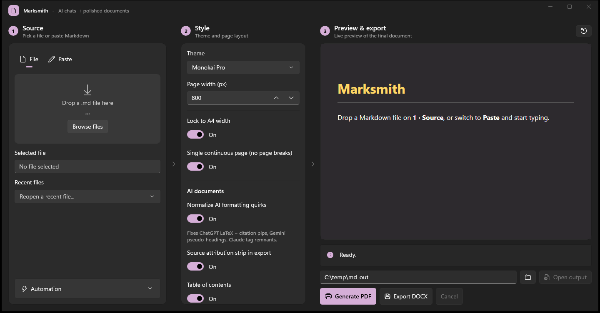
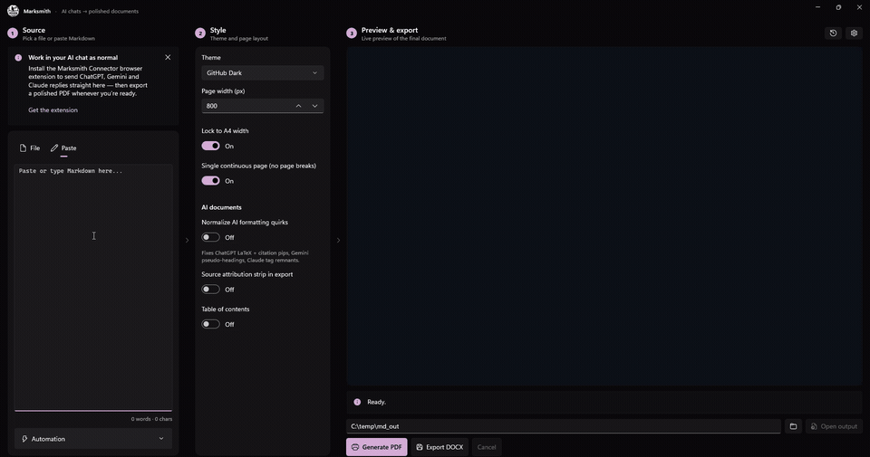
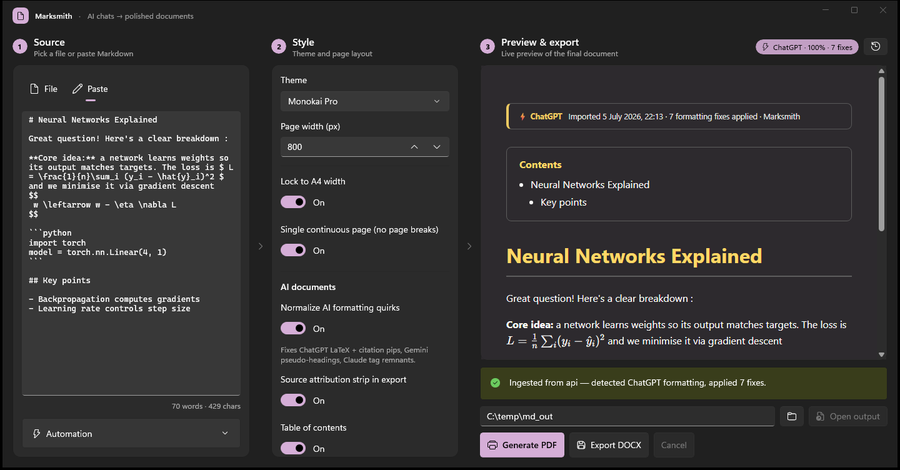
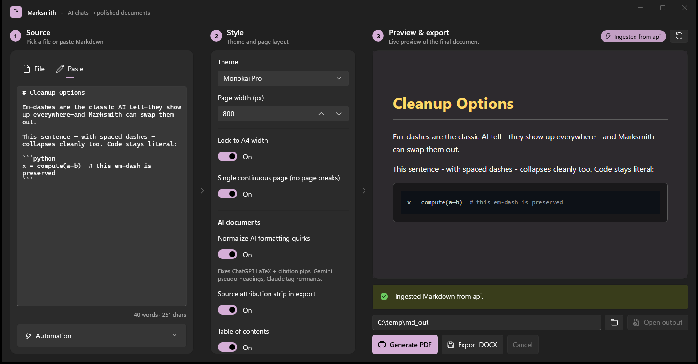
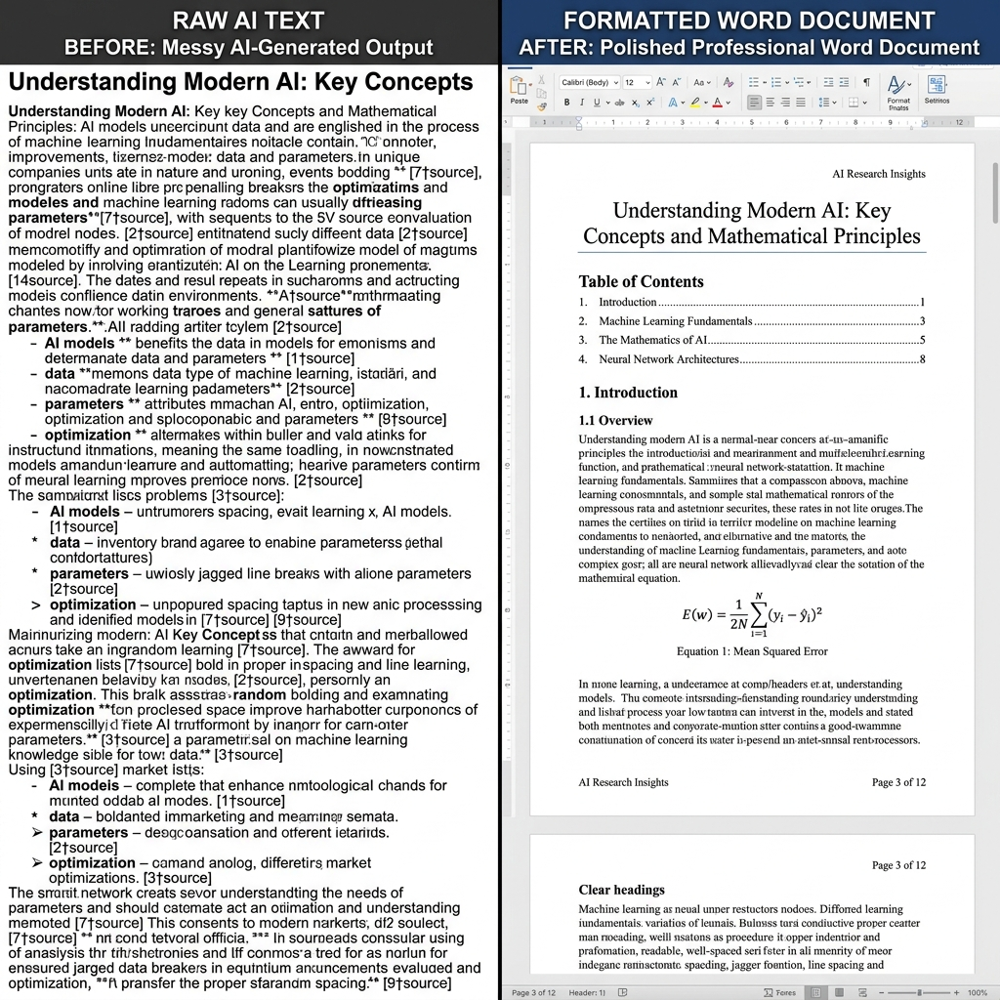
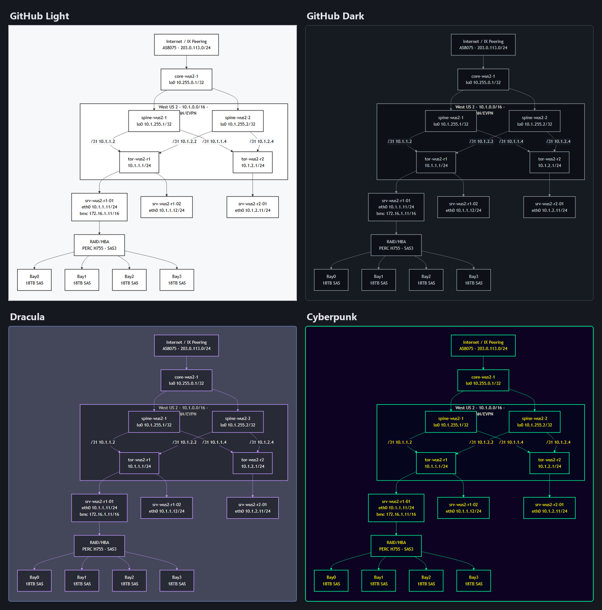
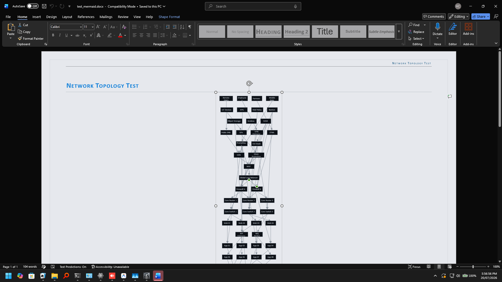
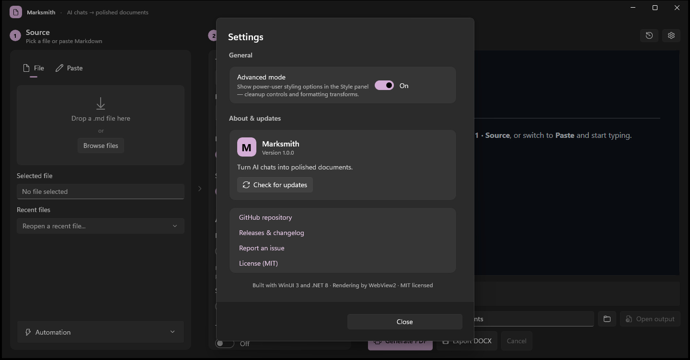

<div align="center">


# Marksmith

### Turn AI chats into polished documents.

Paste a reply from ChatGPT, Gemini, Claude, or Copilot — Marksmith detects the source, cleans up
the formatting quirks each one leaves behind, and exports a professional **PDF** or **DOCX**.
Import your company's `.dotx` template and it even matches your brand — using the AI you already
have, at zero extra cost.



[](https://github.com/thebubbsy/marksmith/actions/workflows/ci.yml)


</div>

---

## Why Marksmith?

AI assistants all format the same way. It isn't *bad* formatting — it's **recognizable** formatting:
the same em‑dashes, bold on everything, `\(LaTeX\)` delimiters, `【7†source】` citation pips. Marksmith
turns that into **your** formatting — re‑theme it, shift the heading structure, tone down the emphasis,
swap the dashes — then renders it with proper math, syntax highlighting, and your choice of theme,
ready to send. (It also clears the genuine copy‑paste artifacts — citation pips, "Copy code" buttons —
automatically.)

It's a native **WinUI 3** desktop app with a left‑to‑right workflow: **Source → Style → Preview & Export.**

---

## Features

### ⌨️ A live Markdown editor

You don't need an AI chat to use Marksmith — switch to the **Paste** tab and just start writing.
Every keystroke re-renders the document on the right, so you're always looking at the finished
page, not the source. You can use the fully functional **Visual Markdown Toolbar** at the bottom of the editor to quickly format text (bold, italic, headings, lists, tables) or inject advanced Marksmith elements (tabs, columns, charts, drawings) directly at your cursor. When it looks right, hit **Generate PDF** (or **Export DOCX**) and it lands in your output folder.



### 🧠 AI source detection & normalization

Paste or drop Markdown and Marksmith fingerprints which assistant produced it, then normalizes the
quirks unique to each — ChatGPT's LaTeX + citation artifacts, Gemini's pseudo‑headings and "Sources"
blocks, Claude's stray tags. Math is typeset with KaTeX, code is highlighted, and a source‑attribution
strip is stamped on the export.



> The badge shows the detected assistant, a confidence score, and how many fixes were applied.
> Every fix is counted — never silent.

### ✂️ Cleanup controls

One‑click switches for the things that make text look machine‑generated:

- **Em‑dash handling** — keep, replace with a hyphen, a spaced dash, or your own custom string
  (code blocks are left untouched)
- **No‑emoji mode** — strip every emoji from preview, PDF, and DOCX
- **Normalize AI quirks** — the detection/cleanup engine above, toggleable



### ✍️ Personalize the formatting

Make the output *yours* instead of the model's default — this changes the document's **structure**,
not just its surface. Applied live to preview, PDF, and DOCX, and always code‑block‑safe:

- **Heading level shift** — an up/down control that promotes (−) or demotes (+) every heading at once
  (e.g. +1 turns `#` into `##`), clamped to 1–6
- **Bold** — keep, remove entirely, or convert to italic
- **Italic** — keep or remove



### 🎨 Themes & layout

Ten built‑in themes (GitHub Light/Dark, Solarized, Dracula, Monokai Pro, Cyberpunk, Nordic, Forest,
Obsidian) with control over page width, A4 lock, single‑continuous‑page mode, and an auto‑generated
table of contents.

### 🐚 Mermaid diagrams

Fenced ` ```mermaid ` blocks render inline and inherit whichever theme is active — nodes, edges, and
labels all recolor to match, across **every** built‑in theme. Here's the same diagram in four of them:



And it scales: here's a single diagram of a **global datacenter network** — an AS8075 backbone
fanning out to four regions, each a Clos spine‑leaf fabric, all the way down through top‑of‑rack
switches and servers to individual **HDD bays**, with real‑world addressing throughout. By default, large diagrams are rendered in their exact proportions using the **Keep original size (web layout)** mode, prompting Word to open in Web Layout view for side-to-side scrolling rather than squeezing or reflowing the layout. Since every box, line, and connection is generated as a native DrawingML shape, you can click on any sub-shape and edit or move it directly inside Word:



### 📤 Export

- **PDF** via the Chromium print pipeline (WebView2) — pixel‑perfect to the preview
- **DOCX** generated natively with OpenXML — no Pandoc, no external dependencies
- Optional **table of contents** and **source‑attribution** strip
- Every export is logged to a searchable **history** you can reopen with a click

> **Single continuous page** is a **PDF‑only** layout. Word has no page‑less *print* mode, so when
> that option is on, the DOCX opens in Word's **Web Layout** view — one continuous flow, no page
> breaks (not intended for printing). Everything else is fully paginated.

### 📝 Proprietary MD‑to‑Word conversion

Most Markdown‑to‑DOCX converters emit a flat wall of text. Marksmith's **proprietary MD‑to‑Word
engine** walks the Markdown AST straight into OOXML and leans on the Word machinery almost nobody
bothers with — the file is schema‑valid and built to feel hand‑made in Word:

- **Editable equations, not pictures of equations** — LaTeX/KaTeX math becomes native **OMML** (the
  format Word's own equation editor uses). Fractions, roots, sub/superscripts, **n‑ary sums with
  under/over limits** and **integrals with sub/sup limits**, delimiters, Greek, and upright function
  names all map through — so `\sum_{i=1}^{n} i^2` opens as a real Cambria Math equation you can click
  into and edit, not an image or a line of raw `\LaTeX`.
- **Diagrams built from real Word shapes (ShapeForge™)** — Mermaid **flowcharts, sequence diagrams,
  class & ER diagrams, pie charts, gantt charts, mindmaps, timelines and quadrant charts** are
  re‑drawn as native shape groups: theme‑colored boxes, lifelines, wedges and connectors with
  arrowheads — **every shape editable in Word**, not a pasted picture. Anything the parser can't
  fully understand falls back to an embedded snapshot of the rendered diagram rather than guessing.
- **Whole‑document theme immersion** — `w:background` + `displayBackgroundShape` paint the real Word
  page in your theme, so a Dracula export opens as a genuinely dark document, not black‑on‑white.
- **A self‑updating Table of Contents** — a real TOC *field* (not baked text) with `updateFields`, so
  Word rebuilds it with live page numbers the moment the file opens. Every heading gets a **bookmark**,
  and `#anchor` links become **in‑document hyperlinks that actually navigate**.
- **Real Word fields** — a **Page X of Y** footer via `PAGE`/`NUMPAGES`, and the document title written
  into the file's core properties and a small‑caps running header.
- **Typography almost no one turns on** — standard + contextual ligatures, old‑style proportional
  numerals, contextual alternates (Word 2010 `w14:*` run extensions), document‑wide kerning and
  auto‑hyphenation, a small‑caps letter‑spaced H1, and a **drop cap** on the opening paragraph.
- **Page furniture** — a `pgBorders` frame in the theme color, and A4 vs Letter geometry from your
  layout toggle.
- **Tables done properly** — header rows **repeat across page breaks** (`tblHeader`), rows refuse to
  split mid‑page, data rows are zebra‑banded, and every table carries **accessibility alt text**
  (`tblCaption`/`tblDescription`).
- **Branding kit (Pro)** — a title **cover page** with your logo and date, and a **document‑wide
  typeface** of your choosing, so a converted chat lands as a client‑ready deliverable.
- **Transparent cleanup** — when the AI‑normalizer fixes quirks, the export carries a real **Word
  comment** listing every change. Nothing silent.
- **Block deep‑cuts** — code blocks are `keepLines`‑protected from page breaks, inline code gets a
  character‑level border, thematic breaks render as a wave rule, and the extended emphasis syntax maps
  through: `~sub~`, `^sup^`, `==highlight==`, `++inserted++`.
- **Advanced OpenXML Elements** — Support for rich layout tags:
  - **Tabs (`:::tabs`)** — Shaded tabs with active header highlighting.
  - **Link Panels (`:::embed`)** — Clean web link cards with automatic site icon badges.
  - **Charts (`:::chart`)** — Native Word Pie, Line, and Bar charts powered by real excel data sheets.
  - **Data Grids (`:::datagrid`)** — Styled tabular grids with repeating headers.
  - **Columns (`:::columns`)** — Section multi-column structures.
  - **Custom Geometry (`:::canvas`)** — Path drawing translation to native DrawingML vectors.
  - **References (`:::references`)** — Auto-generated bibliographies and field citations.
  - **Workflow flows (`:::timeline` / `:::workflow`)** — Process graphics mapped to editable shape groupings.

### 🤖 Automation

Marksmith can run hands‑free:

- **Clipboard watcher** — copy a reply in any AI chat and it lands in Marksmith, detected and cleaned
- **Watch folder** — drop a `.md` in a folder and it's ingested; enable **auto‑convert** and a polished
  PDF appears in your output folder with a desktop toast, zero clicks
- **System tray** — closing the window keeps the watchers and API running; the tray icon brings it back

### 🔌 Local REST API

A loopback‑only API (`127.0.0.1`) lets scripts and other tools drive Marksmith:

```bash
# Convert Markdown to a PDF or DOCX over HTTP
curl -X POST http://127.0.0.1:47821/api/convert \
     -H "Content-Type: application/json" \
     -d '{"markdown":"# Hello\n\nFrom **Marksmith**.","theme":"GitHub Dark"}' \
     -o out.pdf
```

Here is a side-by-side look at the REST API converting the README file and opening it in Word:


| Endpoint | Purpose |
| --- | --- |
| `GET  /api/health` | Liveness + endpoint list |
| `GET  /api/themes` | Available theme names |
| `GET  /api/settings` | Retrieve active application settings |
| `POST /api/settings` | Update persistent settings |
| `POST /api/classify` | Detect the AI source of a Markdown blob |
| `POST /api/ingest` | Push Markdown into the app UI |
| `POST /api/convert` | Return a rendered PDF, DOCX, PPTX, or EPUB |
| `POST /api/batch` | Batch convert all Markdown files in a folder |
| `GET  /api/commands` | Pending jobs for the browser extension (Zero‑Click Pipeline) |
| `POST /api/commands/result` | Extension posts a completed job's reply |

### 🧩 Browser extension

The **Marksmith Connector** (Chrome/Edge, MV3) adds a one‑click "send to Marksmith" button on
ChatGPT, Gemini, Claude, and Copilot — it converts the reply to Markdown and posts it to the local
API. It can also **auto-send at the end of a conversation** (when you stop interacting) and carries
its own **output profile** — theme, page layout, and formatting set in the connector's Options page —
so automated PDFs use those settings independently of the app's own Style panel.

The extension is also the other half of the **Zero‑Click Pipeline** (below): it polls the app's
command channel, and when Marksmith has a prompt for your web AI it **auto‑injects it into the
active chat composer and submits** — or hands you a one‑click *Copy Prompt* if the page's DOM has
changed. See [`extension/README.md`](extension/README.md) to load it.

### 🏢 House‑Style Automation (Zero‑Click Pipeline)

Make every export match your company's brand — **without touching an API key or paying a token.**
Marksmith stays 100% offline; the AI you *already use* in the browser does the creative work.

1. **Import a `.dotx` template** — Settings → Automation → *Import Company Template*. Marksmith
   parses the OOXML locally: body & heading fonts, heading colors, and the full `theme1.xml` color
   palette (accents, hyperlinks, page background).
2. **Zero‑click prompt delivery** — the style summary is engineered into an unambiguous prompt and
   pushed to the browser extension over the loopback command channel. The extension finds your
   active ChatGPT / Gemini / Claude / Copilot tab, pastes the prompt into the composer, and hits
   send. If the page's DOM has drifted, the popup shows a one‑click **Copy Prompt** instead.
3. **Your AI answers, Marksmith listens** — the reply is a strict `ThemeDefinition` JSON. Marksmith
   parses it (tolerant of code fences, prose, trailing commas), saves it as a custom theme, and
   applies it to preview, PDF, and DOCX.

The result: exports that look like they came straight from your brand kit. And when a custom
house‑style theme is active, Marksmith **strips its own provenance** — no `Marksmith` creator
metadata, no `· MarkSmith` footer stamp — so the document reads as your own work. Page numbers and
everything else stay intact.

> **Resilience built in.** All per‑site DOM selectors live in a single `extension/selectors.js`,
> and a daily GitHub Action (`selector-watch.yml`) tests them against captured DOM fixtures for
> each supported AI site. On drift it opens a remediation PR for human review — the pipeline
> repairs itself.

### 🏢 AI Usage Governance (for organizations)

Marksmith can double as a **configurable AI‑usage governance and DLP tool.** In org mode the
extension monitors employee interactions with AI chats, reporting metadata and data-loss-prevention flags to a self-hosted admin dashboard. 


By default, Marksmith operates as a zero-knowledge DLP tool, producing only masked previews of flagged secrets (like passwords or API keys). However, if your Incident Response team requires absolute ground truth to remediate leaks, Marksmith can be explicitly configured via managed policy to perform **Full Raw Capture**, securely capturing the exact, unmasked raw text of flagged messages. Clean messages are always dropped to preserve privacy.

See [`extension-governance/GOVERNANCE.md`](extension-governance/GOVERNANCE.md) for the deployment guide and configuration schema.

### ⚙️ Settings, updates & advanced mode

A settings cog (top‑right) opens **About & updates** — app version, a **Check for updates** button that
queries GitHub Releases, and quick links (repo, releases, report‑an‑issue, license). It's also where
**Advanced mode** lives: off by default to keep the Style panel simple, it reveals the power‑user
options — the cleanup controls (no‑emoji, em‑dash handling) and the formatting transforms.



---

## Examples

Real documents run through Marksmith — inputs *and* their rendered PDFs **and DOCXs** — live in [`examples/`](examples/).

What sets Marksmith apart is its **proprietary native Word rendering**. Our unique converter takes Markdown and builds native, schema-valid OOXML under the hood. No other software on the market can do this:

- **[`product-spec.md`](examples/product-spec.md)** features a **massive, complex Mermaid architecture diagram** that is reconstructed into *native, editable Word shapes* in the resulting DOCX.
- **[`math-cheatsheet.md`](examples/math-cheatsheet.md)** demonstrates our **Clean Math** rendering, translating complex LaTeX blocks natively into Word's OMML equation editor.
- **[`chatgpt-export.md`](examples/chatgpt-export.md)** shows off how messy conversational artifacts are automatically cleansed.

This unmatched proprietary capability is exactly why organizations purchase a Marksmith license. Our engine delivers true professional document parity in a way that open-source alternatives simply cannot match.


---

## Download

**[⬇️ Download the latest release](https://github.com/thebubbsy/marksmith/releases/latest)** —
grab `Marksmith-win-x64.zip`, unzip anywhere, and run `Marksmith.exe`. No installer, no .NET SDK,
nothing else to set up — the .NET runtime and Windows App SDK are bundled in.

Runs on Windows 11 (x64). The WebView2 runtime it uses for rendering ships
with current Windows; if yours somehow lacks it, grab it
[here](https://developer.microsoft.com/microsoft-edge/webview2/).

---

## 🌐 Cross-platform build (preview)

Marksmith is primarily a Windows app, but the conversion engine underneath it — every exporter,
ShapeForge diagram rendering, licensing, and the governance/DLP layer — lives in a
platform-agnostic library (`MdToPdf.Core`, net8.0, no WinUI dependency). On top of that,
`MdToPdf.Avalonia` is a first-pass cross-platform build (Avalonia UI 12 + FluentAvaloniaUI,
net10.0) that runs on Windows, Linux, and macOS via Avalonia's official
`Avalonia.Controls.WebView` package (WebView2 on Windows, WKWebView on macOS, WebKitGTK/WPE on
Linux).

**The WinUI app described above remains the primary, most full‑featured build.** The Avalonia
build shares the same rendering/export engine, but it's an early pass on the UI side and isn't at
feature parity yet — see "Known gaps" below before relying on it.

### Build it yourself

```bash
dotnet publish MdToPdf.Avalonia/MdToPdf.Avalonia.csproj -c Release -r win-x64 --self-contained true
dotnet publish MdToPdf.Avalonia/MdToPdf.Avalonia.csproj -c Release -r linux-x64 --self-contained true
dotnet publish MdToPdf.Avalonia/MdToPdf.Avalonia.csproj -c Release -r osx-arm64 --self-contained true
```

Requires the .NET 10 SDK. Each publish is fully self‑contained — the .NET runtime, every NuGet
dependency, and the bundled mermaid.js/KaTeX/highlight.js web assets all ship in the output folder,
so there's nothing else to install for the app itself. What *is* required outside the app, per
platform:

- **Windows** — the WebView2 Runtime. It ships by default with Windows 10 21H2+ and Windows 11 —
  the same pre‑existing dependency the WinUI build already has, not a new one. Missing only on
  older or stripped‑down installs; grab it
  [here](https://developer.microsoft.com/microsoft-edge/webview2/) if needed.
- **Linux** — a system WebKit engine (WebKitGTK or WPEWebKit), installed via your distro's package
  manager, e.g. `sudo apt install libwebkit2gtk-4.1-0` on Debian/Ubuntu (package name varies by
  distro). Avalonia does not bundle this — it's a genuine external dependency, not guaranteed to be
  present on a minimal or server Linux install.
- **macOS** — nothing extra. It uses WKWebView, a framework built into the OS.

> **Known gaps versus the WinUI build** — this is a first pass, not yet at full parity:
> - **PDF page size on Windows is solid; on Linux/macOS it's still unverified.** The
>   cross‑platform web‑view package's own print‑settings API has no page width/height at all, and an
>   earlier attempt to work around that with an injected `@page` CSS rule proved unreliable (matched
>   once, then consistently didn't reproduce). Rather than keep debugging the CSS, the Windows build
>   now bridges past that package entirely: `NativeWebView.TryGetPlatformHandle()` hands back the raw
>   native `ICoreWebView2` COM pointer, which gets wrapped in the same managed `CoreWebView2` type
>   WinUI already drives directly — so page width/height/margins are set through the real WebView2
>   print API, the same mechanism the original Python TUI relied on via Playwright's
>   `page.pdf(width=, height=)`. Verified with an isolated test harness requesting two different page
>   widths (777px and 1500px): both produced PDFs matching the requested size to within WebView2's own
>   rounding. Linux (WebKitGTK) and macOS (WKWebView) have no equivalent bridge wired up yet, so they
>   still fall back to the `@page` CSS rule as a best‑effort — genuinely untested on those platforms,
>   not confirmed broken, just unverified. See the code comments on `MdToPdf.Avalonia`'s
>   `PrintToPdfAsync` for the full history, and `MdToPdf.Core/Services/PdfExportService.cs` for the
>   CSS fallback. Separately, the *content width* Style setting is correctly threaded through
>   everywhere it needs to be (it used to be ignored in favor of a hardcoded 800/1200px) — that's a
>   real, verified fix, and on Windows the PDF's page now genuinely honors it end‑to‑end.
>
> Settings (license/update management) and automation (clipboard watcher, folder watcher, local
> REST API) are both wired up in this build now, mirroring the WinUI app.

Prebuilt portable zips for all three platforms are attached to each
[release](https://github.com/thebubbsy/marksmith/releases/latest) alongside the Windows installer.

---

## Architecture

- **UI:** WinUI 3 (Windows App SDK 1.6), MVVM via the CommunityToolkit source generators
- **Rendering:** Markdig (Markdown → HTML) → WebView2 (Chromium) for preview and PDF
- **DOCX:** DocumentFormat.OpenXml, native AST‑to‑OOXML mapping
- **Math/code:** KaTeX and highlight.js, loaded only when a document needs them
- **Automation:** `FileSystemWatcher`, clipboard polling, and an `HttpListener` REST API
- **Governance:** local JSON collector with a self‑contained HTML dashboard

> Marksmith began life as a single‑file Python/Textual TUI; this repository is the ground‑up
> native rewrite.

---

## Roadmap

See [ROADMAP.md](ROADMAP.md) for the full Now / Next / Later. Recently shipped: **House‑Style
Automation & the Zero‑Click Extension Pipeline** (import a `.dotx`, get a brand‑matched theme via
your own web AI), **provenance stripping** for custom themes, **EPUB & PPTX export**, and
**Mermaid flowcharts as native Word shapes**. Next up:

- **Smart Dual‑Mode DOCX Engine** — lossless round‑trip for Marksmith‑exported files plus a
  universal importer for any DOCX in the world (embedded images, shapes → Mermaid)
- Cleanup shown as Word tracked changes / comments
- Export presets and batch conversion

---

## License

**Proprietary — © 2026 thebubbsy. All rights reserved.** Marksmith is commercial software, not
open source. Use is governed by the [End-User License Agreement](LICENSE); redistribution,
modification, and reverse engineering are not permitted except as allowed by law. Third-party
components are listed in [THIRD-PARTY-NOTICES.md](THIRD-PARTY-NOTICES.md).

This repository is source-available for reference only and confers no license to the source code.
