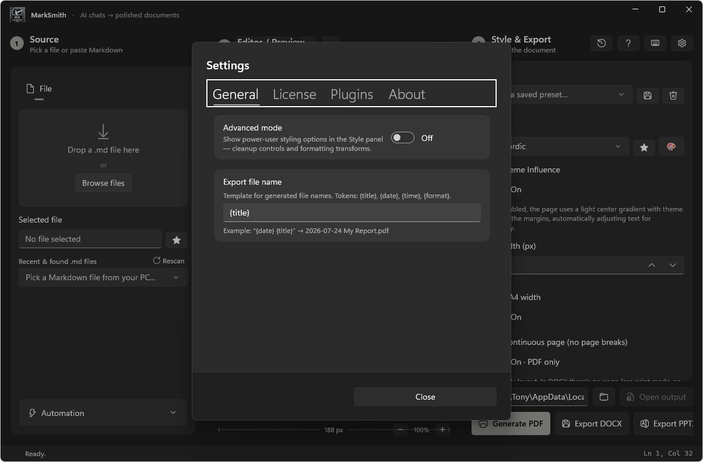
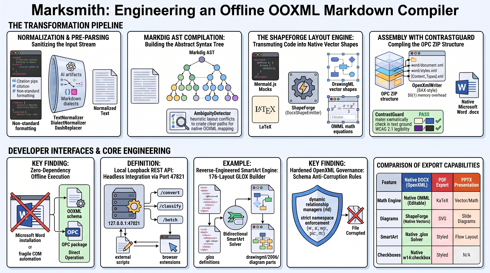

<div align="center">


# Marksmith

### Turn AI chats into polished documents.

Paste a reply from ChatGPT, Gemini, Claude, or Copilot — Marksmith detects the source, cleans up
the formatting quirks each one leaves behind, and exports a professional **PDF** or **DOCX**.
Import your company's `.dotx` template and it even matches your brand — using the AI you already
have, at zero extra cost.


[](https://github.com/thebubbsy/marksmith/actions/workflows/ci.yml)


</div>

---

## Why Marksmith?

Marksmith is, unequivocally, the most advanced **Markdown-to-DOCX converter** on the planet. Its entire existence is dedicated to taking the robotic, highly recognizable formatting of AI outputs (ChatGPT, Gemini, Claude, Copilot) and seamlessly converting it into polished, professional Word documents that actually look like **your own work**.

While other converters often string together flimsy XML that barely resembles your original intent, Marksmith generates native, schema-valid, and flawlessly styled Microsoft Word OOXML. I didn't just approximate your formatting—I reconstructed it natively.

It is a native **WinUI 3** desktop app with a simple, left-to-right workflow: **Source → Style → Preview & Export.**

---

## What Marksmith Does Better Than Anyone Else

I didn't just build a text paster—I constructed a native Word element engine from the ground up. Here is a taste of what a solo developer reverse-engineering Microsoft's formats actually looks like:

### 🧩 True Native Rendering
Marksmith doesn't just screenshot your diagrams. It translates complex structures like **Mermaid diagrams** and charts directly into **editable, native vector shapes (DrawingML)** inside your document. Whether it's a flowchart or a complex global datacenter network, Marksmith scales it flawlessly into Word.

### 📄 Advanced Word & OpenXML Capabilities
- **Flawless Math (OMML)** — Other converters choke on LaTeX. Marksmith converts equations directly into Word's native Equation editor formats (`$x^2 + y^2 = z^2$`). Click any formula and edit it right in Word.
- **Native Lists done right** — I built proper `numbering.xml` linking with `ilvl` indents and `abstractNum` definitions so your lists don't break.
- **Reverse-Engineered SmartArt Engine** — I fully reverse-engineered Word's undocumented SmartArt spatial constraint solver by hand. Marksmith builds completely custom SmartArt topologies from scratch natively.
- **Complex Structures** — Native Word tabs (`:::tabs`), web link cards (`:::embed`), styled data grids (`:::datagrid`), continuous column breaks (`:::columns`), and real Word pie/line/bar charts (`:::chart`) backed by embedded Excel parts.

### 🧠 AI Normalization & Cleanup
Marksmith fingerprints the AI assistant that generated your text and normalizes the unique quirks of each. With one click, you can strip out citation pips, swap machine-generated em-dashes for human formatting, kill emojis, and restructure heading levels to match human writing.



### 🖼️ Pixel-Perfect HTML Preview
See exactly what your DOCX will look like before you hit export. Instead of relying on clunky, unreliable Word plugins that inevitably crash, Marksmith uses a custom, hyper-accurate HTML rendering engine to show you a live preview of your document. It instantly matches your styles, spacing, and layouts so that what you see on the screen is exactly what ships in the Word document.



### ⌨️ A Live Markdown Editor
You don't even need an AI chat to use Marksmith. Switch to the **Paste** tab, start writing, and use the Visual Markdown Toolbar to inject elements right at your cursor. Every keystroke re-renders the document live.


---

## 🤖 Automation & CLI Tools

### 💻 Standalone Marksmith CLI

Marksmith includes a standalone command-line compiler for terminal workflows and automated build scripts:

```pwsh
# Convert Markdown to Word DOCX
marksmith <input.md> <output.docx> [layout_alias]

# Build a custom SmartArt GLOX package
marksmith build-layout <input_layout.json> <output.glox>
```

### 🔌 Local REST API

A loopback‑only API (`127.0.0.1:47821`) lets scripts and other tools drive Marksmith:

```bash
# Convert Markdown to a PDF or DOCX over HTTP
curl -X POST http://127.0.0.1:47821/api/convert \
     -H "Content-Type: application/json" \
     -d '{"markdown":"# Hello\n\nFrom **Marksmith**.","theme":"GitHub Dark"}' \
     -o out.pdf
```


| Endpoint | Purpose |
| --- | --- |
| `GET  /api/health` | Liveness + endpoint list |
| `GET  /api/themes` | Available theme names |
| `GET  /api/settings` | Retrieve active application settings |
| `POST /api/settings` | Update persistent settings |
| `POST /api/classify` | Detect the AI source of a Markdown blob |
| `POST /api/ingest` | Push Markdown into the app UI |
| `POST /api/convert` | Return a rendered PDF, DOCX, PPTX, or EPUB |
| `POST /api/batch` | Batch convert all Markdown files in a folder |
| `GET  /api/commands` | Pending jobs for the browser extension (Zero‑Click Pipeline) |
| `POST /api/commands/result` | Extension posts a completed job's reply |

### 🧩 Browser extension

The **Marksmith Connector** (Chrome/Edge, MV3) adds a one‑click "send to Marksmith" button on
ChatGPT, Gemini, Claude, and Copilot — it converts the reply to Markdown and posts it to the local
API. It can also **auto-send at the end of a conversation** (when you stop interacting) and carries
its own **output profile** — theme, page layout, and formatting set in the connector's Options page —
so automated PDFs use those settings independently of the app's own Style panel.

### 🏢 House‑Style Automation (Zero‑Click Pipeline)

Make every export match your company's brand — **without touching an API key or paying a token.**
Marksmith stays 100% offline; the AI you *already use* in the browser does the creative work.

1. **Import a `.dotx` template** — Settings → Automation → *Import Company Template*. Marksmith
   parses the OOXML locally: body & heading fonts, heading colors, and the full `theme1.xml` color
   palette (accents, hyperlinks, page background).
2. **Zero‑click prompt delivery** — the style summary is engineered into an unambiguous prompt and
   pushed to the browser extension over the loopback command channel. The extension finds your
   active ChatGPT / Gemini / Claude / Copilot tab, pastes the prompt into the composer, and hits
   send.


3. **Your AI answers, Marksmith listens** — the reply is a strict `ThemeDefinition` JSON. Marksmith
   parses it, saves it as a custom theme, and applies it to preview, PDF, and DOCX.


### 🏢 AI Usage Governance (for organizations)

Marksmith can double as a **configurable AI‑usage governance and DLP tool.** In org mode the
extension monitors employee interactions with AI chats, reporting metadata and data-loss-prevention flags to a self-hosted admin dashboard. 


---

## Examples

Real documents run through Marksmith — inputs *and* their rendered PDFs **and DOCXs** — live in [`examples/`](examples/).

What sets Marksmith apart is its **proprietary native Word rendering**. Our unique converter takes Markdown and builds native, schema-valid OOXML under the hood. No other software on the market can do this:

- **[`product-spec.md`](examples/product-spec.md)** features a **massive, complex Mermaid architecture diagram** that is reconstructed into *native, editable Word shapes* in the resulting DOCX.
- **[`math-cheatsheet.md`](examples/math-cheatsheet.md)** demonstrates our **Clean Math** rendering, translating complex LaTeX blocks natively into Word's OMML equation editor.
- **[`chatgpt-export.md`](examples/chatgpt-export.md)** shows off how messy conversational artifacts are automatically cleansed.


---

## Download

**[⬇️ Download the latest release](https://github.com/thebubbsy/marksmith/releases/latest)** —
grab `Marksmith-win-x64.zip`, unzip anywhere, and run `Marksmith.exe`. No installer, no .NET SDK,
nothing else to set up — the .NET runtime and Windows App SDK are bundled in.

---

## Architecture

- **UI:** WinUI 3 (Windows App SDK 1.6), MVVM via CommunityToolkit.Mvvm in `marksmith-v2/MarkSmith.Desktop`
- **Core Engine (`marksmith-v2/MarkSmith.Core`):** Reverse-engineered SmartArt layout engine, constraint solver, GLOX Builder Suite, AST parsers, & document exporters
- **CLI (`marksmith-v2/MarkSmith.Cli`):** Standalone zero-dependency command-line compiler and `.glox` layout builder
- **REST API Daemon (`marksmith-v2/MarkSmith.Api`):** Local loopback REST API server
- **Test Suite (`marksmith-v2/MarkSmith.Tests`):** Consolidated empirical test suite and OpenXML schema validator
- **Rendering:** Markdig (Markdown → HTML) → WebView2 (Chromium) for preview and PDF
- **DOCX Exporter:** DocumentFormat.OpenXml, native AST‑to‑OOXML mapping & OMML math
- **Automation:** `FileSystemWatcher`, clipboard polling, and `HttpListener` REST API
- **Governance:** local JSON collector with a self‑contained HTML dashboard

---

## Roadmap

See [ROADMAP.md](ROADMAP.md) for the full Now / Next / Later.

---

## License

**Proprietary — © 2026 Matthew Barber. All rights reserved.** 
Marksmith is commercial, proprietary technology. The source code is visible publicly out of the kindness of my heart. If anyone tries to steal my code, recreate it, and use this application for free, then fuck you.

Use is governed by the [End-User License Agreement](LICENSE); redistribution, modification, and reverse engineering are not permitted except as allowed by law. Third-party components are listed in [THIRD-PARTY-NOTICES.md](THIRD-PARTY-NOTICES.md).
