<div align="center">


# Marksmith

### Turn AI chats into documents that look like you wrote them.

Paste a reply from ChatGPT, Gemini, Claude, or Copilot. Marksmith detects the source, strips the
tells, and compiles it into **native Microsoft Word OOXML** — real equations, real vector shapes,
real tables. Not a screenshot. Not an HTML-in-a-Word-wrapper approximation. The actual XML Word
would have written itself.

[](https://github.com/thebubbsy/marksmith/actions/workflows/ci.yml)


</div>

---

## Watch it work

Markdown arrives over the loopback API — from the browser extension, the clipboard, or a file — and
the preview keeps up with it live: GitHub alerts, KaTeX math and Mermaid diagrams rendering as the
document streams in.

<div align="center">
  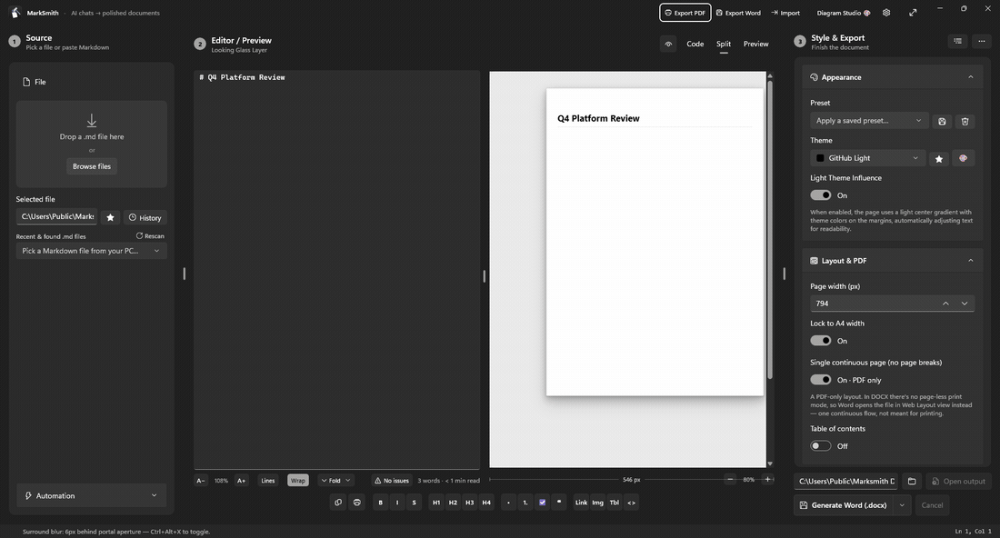
  <br />
  <em><a href="docs/media/desktop-demo.mp4">Full-resolution MP4</a> · recorded from a Release build, driven over <code>POST /api/ingest</code></em>
</div>

---

## The part nobody else does

Every "Markdown to Word" tool can produce a `.docx`. Almost all of them shove HTML into a Word
wrapper, or paste a picture of your diagram. Marksmith emits the real thing — so the equation opens
in Word's equation editor, and the flowchart is a group of shapes you can drag.

**Below is a Marksmith `.docx`, opened in Microsoft Word and exported by Word's own engine.**
Nothing on this page was rasterized by us.

<div align="center">
  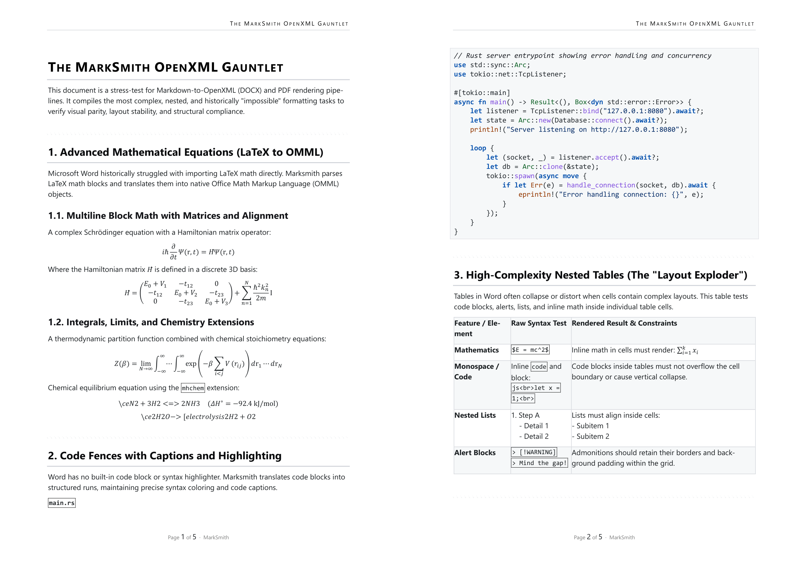
</div>

There is a Schrödinger equation and a 3×3 Hamiltonian matrix living in Word's **native OMML**
equation editor, a Rust code block with **preserved syntax colouring**, a running header and page
numbering, and a table whose cells hold inline math, nested lists and code without collapsing.

Diagrams get the same treatment — a Mermaid `flowchart` fence becomes **native DrawingML shapes**,
with cylinders for the datastores and real connectors between them:

<div align="center">
  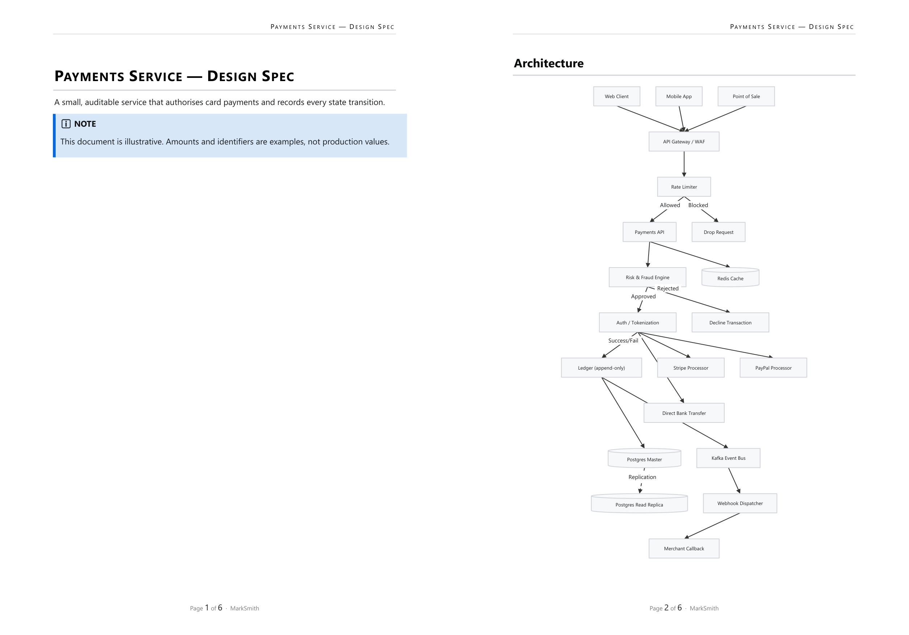
</div>

> Click any box in Word and drag it. It moves — because it is a shape, not a PNG.

---

## The workflow

Marksmith is a native **WinUI 3** app with one left-to-right path:
**Source → Editor / Preview → Style & Export.**

### 1. It knows where the text came from

Paste a ChatGPT reply and Marksmith fingerprints it, then removes the citation pips, the
`:contentReference[oaicite:0]` residue, the stray "Copy code" lines and the trailing disclaimer.
The status bar says exactly what it found and how many fixes it applied.

<div align="center">
  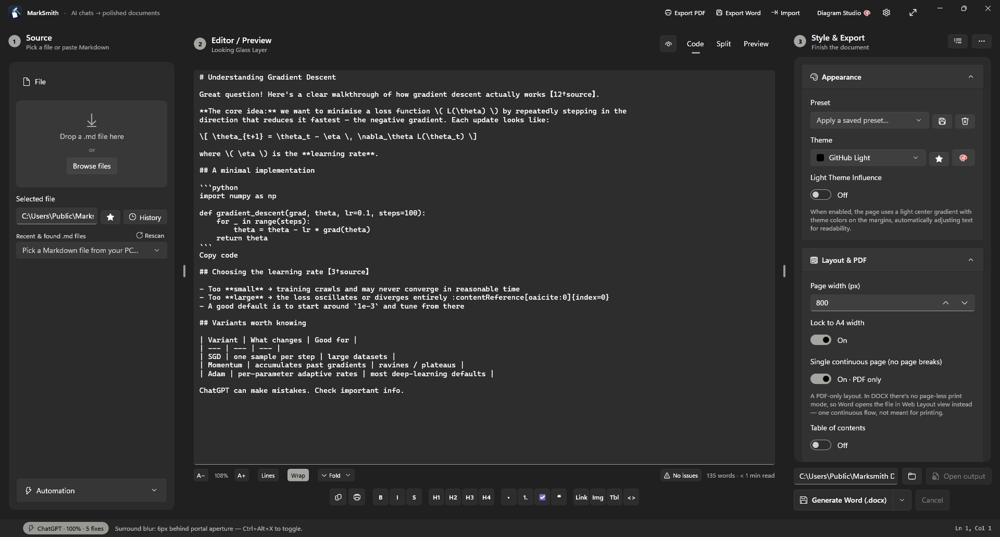
</div>

### 2. Split view keeps source and result honest

Markdown on the left, the real rendered document on the right — the same HTML pipeline that backs
the PDF export, so what you see is what ships.

<div align="center">
  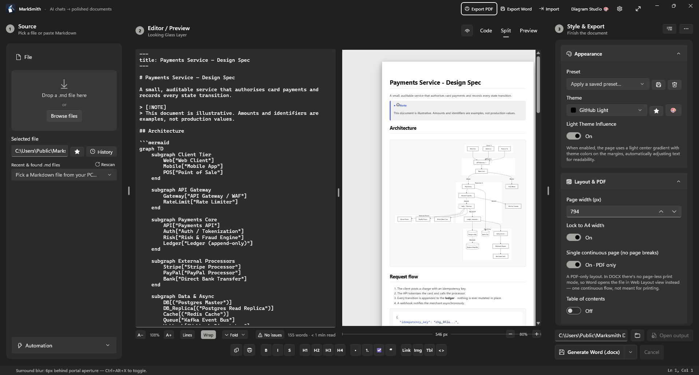
</div>

### 3. The Looking Glass

The rendered page *is* the editing surface. Click anywhere on it and a portal cuts through to the
Markdown behind that exact block; the surrounding page falls slightly out of focus so the aperture
reads as the thing you are working in. Type inside the glass and the characters land in three places
at once — the aperture, the rendered page behind it, and the editor in the other pane — with no
navigation, no mode switch, and no losing your place.

<div align="center">
  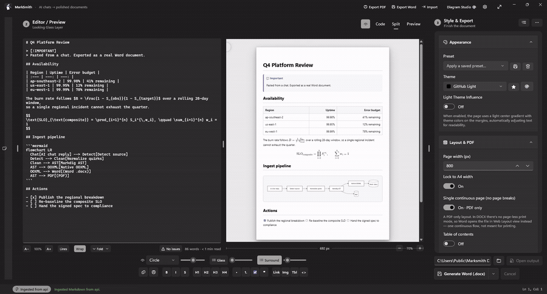
  <br />
  <em><a href="docs/media/looking-glass.mp4">Full-resolution MP4</a> · recorded from a Release build, document streamed over <code>POST /api/ingest</code></em>
</div>

Watch the word count under the editor tick up as the sentence is typed — that is the same document,
updating in every pane, from one caret inside the glass.

The aperture is a circle, a full-width focus band, a square, or the Marksmith logo cutout; its size,
its own blur and the surround blur are all live dials on the portal bar (`Ctrl+Alt+X` toggles the
surround blur without leaving the keyboard).

### 4. Export

**PDF**, **DOCX**, **PPTX**, **EPUB**, **HTML** or a high-DPI **PNG** snapshot — from the title bar,
the command palette (`Ctrl+K`), a keyboard shortcut, or the CLI.

---

## What the engine actually renders

Every image below is the real preview pipeline, captured from a compiled build.

<table>
<tr>
<td width="50%" valign="top">

**LaTeX → OMML, with chemistry**

`$$…$$`, `\[…\]`, matrices, limits, integrals — and `mhchem` (`\ce{}`) reaction arrows in the
preview and PDF.

</td>
<td width="50%" valign="top">

**Blocks inside table cells**

GFM says a table cell is inline-only. Marksmith recovers the block content anyway — a GitHub alert,
a `<br>`-joined list — as a real callout and a real list, in the preview *and* the native Word table.

</td>
</tr>
<tr>
<td>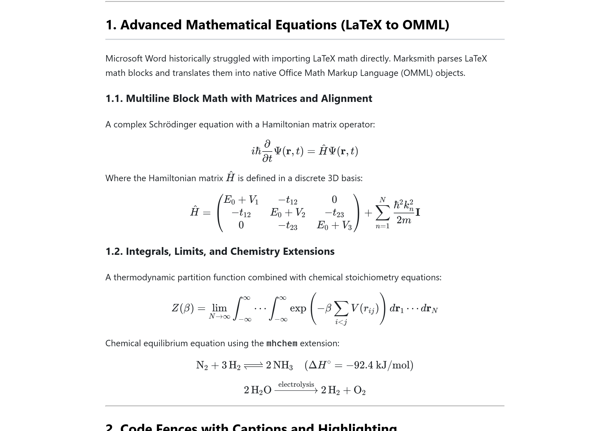</td>
<td>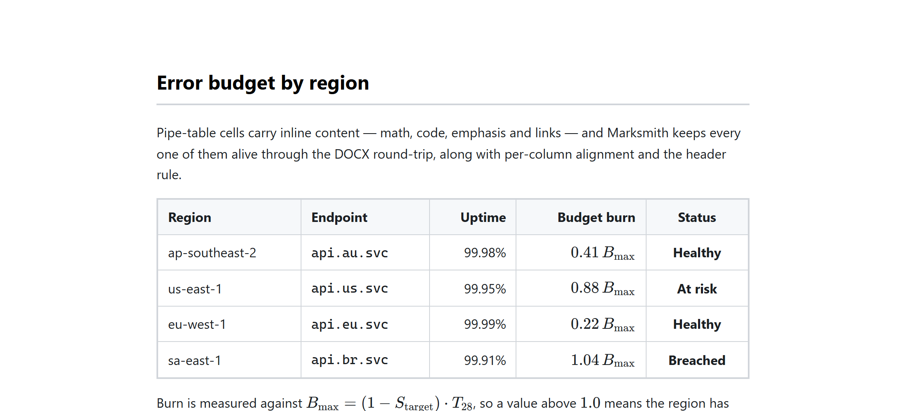</td>
</tr>
<tr>
<td width="50%" valign="top">

**Mermaid, natively**

Flowcharts, sequence, state, class, ER, Gantt, mindmap and more — vector in the preview, DrawingML
shapes in Word.

</td>
<td width="50%" valign="top">

**Dialects, callouts and folds**

GitHub alerts, Obsidian foldable callouts, wiki-links and tags — normalized from Notion, MkDocs and
Docusaurus forms too.

</td>
</tr>
<tr>
<td>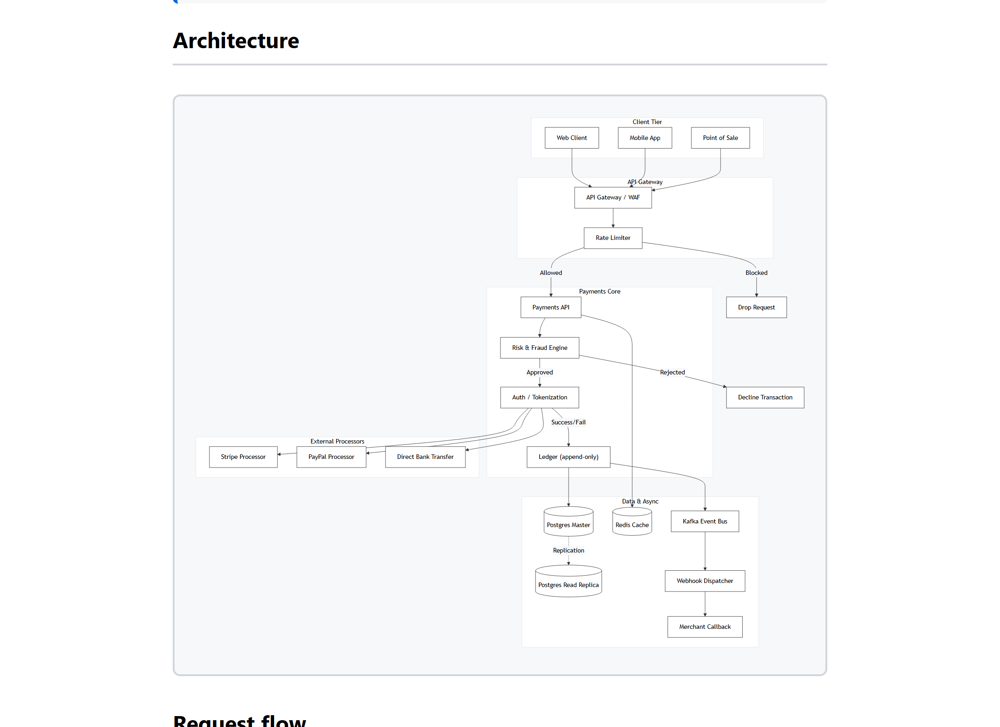</td>
<td>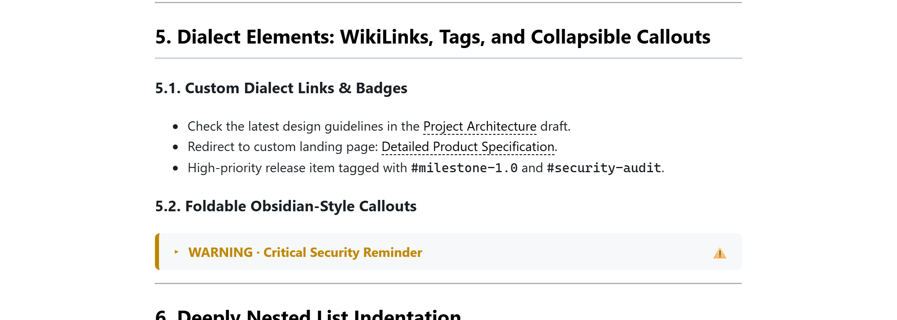</td>
</tr>
</table>

### Word features Markdown was never supposed to reach

| Wrapper | What Word gets |
|---|---|
| `:::smartart type="hierarchy…"` | Native SmartArt via embedded `.glox` layouts and a constraint solver |
| `:::watermark "DRAFT"` | Diagonal VML watermark in `word/header1.xml` |
| `:::line-numbers --count-by 5` | `<w:lnNumType>` margin numbering, per-page or continuous |
| `:::cover-page` | Title page with `<w:titlePg>` and a page-2 numbering restart |
| `:::dropcap 3` | A real `<w:framePr>` dropped capital |
| `:::index` + `^[index: "…"]` | `XE` field anchors and a generated `INDEX` back-of-book concordance |
| `=SUM(ABOVE)`, `=AVERAGE(LEFT)` | `<w:fldSimple>` formulas Word recalculates on open |
| `- [ ]`, `[dropdown: …]`, `[date: …]` | `<w:sdt>` content controls — checkboxes, pickers, text fields |
| `{--cut--}` / `{++added++}` / `^[Author: "…"]` | `<w:del>` / `<w:ins>` tracked changes and `word/comments.xml` |
| `:::columns`, `:::tabs`, `:::chart`, `:::timeline` | Section breaks, outline tabs, charts backed by embedded Excel parts |
| `> [!NOTE]` … `> [!CAUTION]` | Single-cell themed callout tables with accent borders |

Every wrapper is held to a two-pipeline contract: the DOCX exporter and the HTML preview must accept
the same syntax, and adding one to only half of them is a bug. Working examples of each live in
[`examples/`](examples/).

---

## Marksmith Express — the cross-platform edition

A zero-dependency loopback web UI and REST API over the same `MarkSmith.Core` engine. No Windows, no
installer, no account: one binary, one port.

Express is a **converter, not an editor** — drop a file, set the output profile, take the document.
It carries the same export profile the desktop app and the browser extension use, so a theme,
heading shift or dash rule means the same thing everywhere. Settings a given exporter does not read
are shown disabled and labelled with the formats that do use them, so nothing in the panel is
decorative.

```bash
marksmith-express --port 5000
```

<div align="center">
  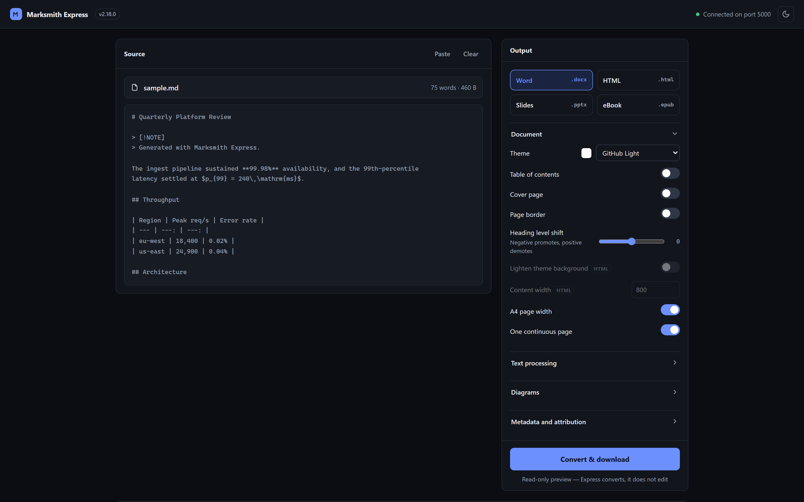
</div>

<div align="center">
  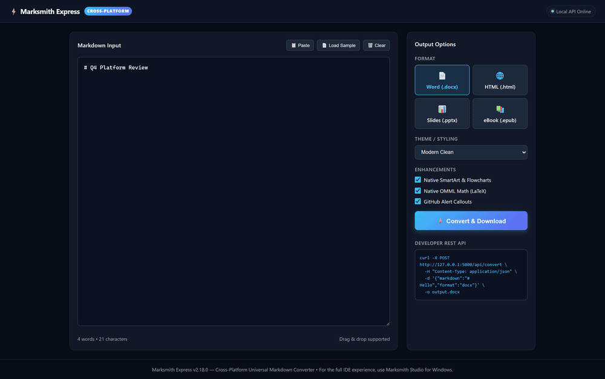
  <br />
  <em><a href="docs/media/express-demo.mp4">Full-resolution MP4</a></em>
</div>

```bash
curl -X POST http://127.0.0.1:5000/api/convert \
     -H "Content-Type: application/json" \
     -d '{"markdown":"# Hello\n\nFrom **Marksmith Express**.",
          "format":"docx",
          "options":{"theme":"GitHub Light","includeToc":true,"headingShift":1}}' \
     -o out.docx
```

`options` takes any field of the shared output override, so the API reaches the same settings the
UI does. `GET /api/options` returns the live theme and font catalogs plus the supported formats, so
a client never has to hard-code them.

---

## CLI

A standalone compiler for terminals, build scripts and CI.

```pwsh
# Markdown -> Word, HTML, or a high-DPI PNG snapshot
marksmith <input.md> <output.docx|.html|.png> [--theme <name>] [--watch]
marksmith render-image <input.md> <output.png> [--width 1200] [--scale 2.0] [--theme "GitHub Light"]

# Whole folders, recursively, without stopping on a bad file
marksmith batch <folder|glob> [--output <dir>] [--format docx|html] [-r] [-f] [--concurrency <n>]

# Vector shape and line-art tools
marksmith compose <image.png> <output.docx|.md> [--grid 32] [--compact]
marksmith trace   <image.png> <output.docx|.md> [--rows 300] [--mode CrossHatch]
```

---

## Local REST API

The desktop app runs a loopback-only API on `127.0.0.1:47821` (Express defaults to `:5000`), with
CORS and origin protection so a random web page cannot drive your machine.

| Endpoint | Purpose |
| --- | --- |
| `GET  /api/health` | Liveness and endpoint list |
| `GET  /api/themes` | Available theme names |
| `GET  /api/settings` · `POST /api/settings` | Read / update persistent settings |
| `POST /api/classify` | Detect which AI wrote a Markdown blob |
| `POST /api/ingest` | Push Markdown straight into the app UI |
| `POST /api/convert` | Return a rendered PDF, DOCX, PPTX or EPUB |
| `POST /api/batch` | Convert every Markdown file in a folder |
| `GET  /api/commands` · `POST /api/commands/result` | Zero-click pipeline job channel for the extension |

### Browser extension

**Marksmith Connector** (Chrome/Edge, MV3) adds a one-click *send to Marksmith* button on ChatGPT,
Gemini, Claude and Copilot. It converts the reply to Markdown, posts it to the local API, and can
**auto-send when a conversation goes quiet**. It carries its own output profile — theme, page layout,
formatting — so automated exports do not depend on whatever the app's Style panel happens to be set
to.

### House-style automation, with no API key

Match your employer's brand **without paying for a single token.** Marksmith stays offline; the AI
you already have open in the browser does the creative work.

1. **Import a `.dotx`** — Settings → Automation → *Import Company Template*. Marksmith parses the
   OOXML locally: body and heading fonts, heading colours, and the whole `theme1.xml` palette.
2. **Zero-click prompt delivery** — the style summary is compiled into an unambiguous prompt and
   pushed to the extension over the loopback command channel, which pastes it into your active
   ChatGPT / Gemini / Claude / Copilot tab and sends it.

   

3. **The reply comes back as a strict `ThemeDefinition` JSON**, which Marksmith saves as a custom
   theme and applies to preview, PDF and DOCX.

   

### AI usage governance (for organisations)

In org mode the extension reports interaction metadata and data-loss-prevention flags to a
self-hosted admin dashboard — regex-based DLP, PII masking, and local-only telemetry.

<div align="center">
  
</div>

---

## Examples

Real documents — inputs *and* rendered outputs — live in [`examples/`](examples/):

- **[`product-spec.md`](examples/product-spec.md)** — a large Mermaid architecture diagram
  reconstructed as native, editable Word shapes.
- **[`math-cheatsheet.md`](examples/math-cheatsheet.md)** — LaTeX translated into Word's OMML
  equation editor.
- **[`gauntlet.md`](examples/gauntlet.md)** — the stress test: matrices, mhchem, nested tables, tabs,
  dialect callouts, deep lists and multi-line footnotes.
- **[`chatgpt-export.md`](examples/chatgpt-export.md)** — a messy conversational dump, cleaned.

---

## Architecture

| Project | Role |
|---|---|
| `marksmith-v2/MarkSmith.Core` | The engine: normalizers, feature pipeline, SmartArt constraint solver, GLOX builder, DOCX/PPTX/EPUB exporters, SkiaSharp rasterizer |
| `marksmith-v2/MarkSmith.Desktop` | WinUI 3 app (Windows App SDK 1.6), MVVM via CommunityToolkit.Mvvm |
| `marksmith-v2/MarkSmith.Cli` | Standalone compiler, batch runner and `.glox` layout builder |
| `marksmith-v2/MarkSmith.Express` | Cross-platform loopback web UI and REST server |
| `marksmith-v2/MarkSmith.Tests` | Empirical suite with an ECMA-376 `OpenXmlValidator` schema gate |

- **Rendering:** Markdig → HTML → WebView2 (Chromium) for preview and PDF. KaTeX, Mermaid and
  highlight.js are bundled and served from a local virtual host, so the app never phones home.
- **DOCX:** DocumentFormat.OpenXml, AST-to-OOXML mapping, OMML math, dynamic relationship IDs.
- **Automation:** `FileSystemWatcher`, clipboard polling, `HttpListener` REST API.

### Regenerating the media in this README

Every screenshot, GIF and video above is reproducible from a Release build:

```pwsh
python tools/capture/capture_desktop.py                                   # app screenshots (PrintWindow — app window only)
python tools/capture/record_desktop.py                                    # the demo recording, driven over /api/ingest
python tools/capture/record_looking_glass.py                              # the portal recording (drives real clicks — needs the foreground)
python tools/capture/capture_word.py <doc.docx> <out.png> --pages 1,2     # Word's own rendering, via COM + PyMuPDF
node   tools/capture/render-doc.mjs <doc.html> <out.png> --from "Heading"  # preview close-ups
node   tools/capture/cdp-capture.mjs http://127.0.0.1:5000/ docs/media     # Marksmith Express
```

**Run these on Windows.** `capture_desktop.py` and `record_desktop.py` drive the WinUI app through
`win32gui`, and `capture_word.py` drives Microsoft Word itself over COM — there is no substitute for
either, which is the point: the images are Word's own layout and the app's own window, not a
re-implementation.

`render-doc.mjs` will run anywhere with a Chromium (set `CHROME_PATH` to override discovery), but the
HTML asks for **Segoe UI** and **Cascadia Code**. Off Windows those silently fall back to whatever
the host has, so the prose renders in the wrong typeface while the maths stays correct (KaTeX ships
its own fonts). A capture made that way is a real render but not what a customer sees — regenerate
the committed media on Windows.

---

## Pricing

Free for PDF, HTML and Markdown. Word, PowerPoint and automation need a one-time Pro upgrade.

| | **Free** | **Pro** — A$39 one-time |
|---|:---:|:---:|
| Markdown → PDF / HTML / Markdown | ✅ | ✅ |
| Live preview with 20+ themes | ✅ | ✅ |
| Mermaid, LaTeX math, SmartArt, shapes | ✅ | ✅ |
| Diagram Studio and Shape Studio | ✅ | ✅ |
| Mind Map Galaxy | ✅ | ✅ |
| CLI (`render-image`, `batch --format html`) | ✅ | ✅ |
| **Markdown → Word (.docx)** | 3-export trial | ✅ Unlimited |
| **Markdown → PowerPoint (.pptx)** | — | ✅ |
| **Batch conversion** | — | ✅ |
| **Watch-folder automation** | — | ✅ |
| **Clipboard AI ingest** | — | ✅ |
| **"Made with Marksmith" footer** | Shown | Removed |

> Start a free 3-export trial from Settings → License. No account needed.

## Download

| Channel | Link |
|---|---|
| **Windows installer** | [GitHub Releases](https://github.com/thebubbsy/marksmith/releases/latest) |
| **Portable ZIP** | [`Marksmith-win-x64.zip`](https://github.com/thebubbsy/marksmith/releases/latest) — unzip anywhere and run `Marksmith.exe`. The .NET runtime and Windows App SDK are bundled. |
| **winget** | `winget install thebubbsy.Marksmith` |
| **Chocolatey** | `choco install marksmith` |
| **CLI** | `dotnet tool install -g marksmith` *(coming soon)* |

## Roadmap

See [FEATURES.md](FEATURES.md) for the current capability matrix.

---

## License

**Proprietary — © 2026 Matthew Bubb. All rights reserved.**

Marksmith is commercial software. The source is public for transparency, not for reuse: copying,
redistribution, modification and reverse engineering are not permitted except as allowed by law. Use
is governed by the [End-User License Agreement](LICENSE); third-party components are listed in
[THIRD-PARTY-NOTICES.md](THIRD-PARTY-NOTICES.md).
