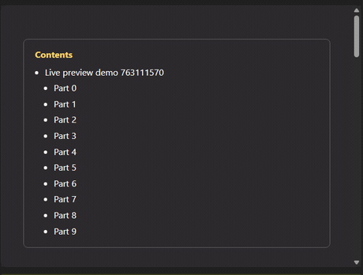

<div align="center">

# Marksmith

### Turn AI chats into polished documents.

Paste a reply from ChatGPT, Gemini, or Claude — Marksmith detects the source, cleans up the
formatting quirks each one leaves behind, and exports a professional **PDF** or **DOCX**.


</div>

---

## Why Marksmith?

AI assistants are great at writing and terrible at formatting. Copy a reply out of the web UI and
you get `\(LaTeX\)` delimiters, `【7†source】` citation pips, "Copy code" buttons, em‑dashes
everywhere, and headings that are really just bold lines. Marksmith knows each assistant's tells and
fixes them automatically, then renders the result with proper math, syntax highlighting, and your
choice of theme — ready to send.

It's a native **WinUI 3** desktop app with a left‑to‑right workflow: **Source → Style → Preview & Export.**

---

## Features

### 🧠 AI source detection & normalization

Paste or drop Markdown and Marksmith fingerprints which assistant produced it, then normalizes the
quirks unique to each — ChatGPT's LaTeX + citation artifacts, Gemini's pseudo‑headings and "Sources"
blocks, Claude's stray tags. Math is typeset with KaTeX, code is highlighted, and a source‑attribution
strip is stamped on the export.


> The badge shows the detected assistant, a confidence score, and how many fixes were applied.
> Every fix is counted — never silent.

### ✂️ Cleanup controls

One‑click switches for the things that make text look machine‑generated:

- **Em‑dash handling** — keep, replace with a hyphen, a spaced dash, or your own custom string
  (code blocks are left untouched)
- **No‑emoji mode** — strip every emoji from preview, PDF, and DOCX
- **Normalize AI quirks** — the detection/cleanup engine above, toggleable


### ⚡ Live preview

The preview re‑renders on every change — no refresh button. A minimum‑duration, on‑brand loading
animation (it randomises between an orbiting clock, a figure‑eight, and a DVD‑logo bounce) means fast
edits never flash white.



### 🎨 Themes & layout

Ten built‑in themes (GitHub Light/Dark, Solarized, Dracula, Monokai Pro, Cyberpunk, Nordic, Forest,
Obsidian) with control over page width, A4 lock, single‑continuous‑page mode, and an auto‑generated
table of contents. Mermaid diagrams render inline.

### 📤 Export

- **PDF** via the Chromium print pipeline (WebView2) — pixel‑perfect to the preview
- **DOCX** generated natively with OpenXML — no Pandoc, no external dependencies
- Optional **table of contents** and **source‑attribution** strip
- Every export is logged to a searchable **history** you can reopen with a click

### 🤖 Automation

Marksmith can run hands‑free:

- **Clipboard watcher** — copy a reply in any AI chat and it lands in Marksmith, detected and cleaned
- **Watch folder** — drop a `.md` in a folder and it's ingested; enable **auto‑convert** and a polished
  PDF appears in your output folder with a desktop toast, zero clicks
- **System tray** — closing the window keeps the watchers and API running; the tray icon brings it back

### 🔌 Local REST API

A loopback‑only API (`127.0.0.1`) lets scripts and other tools drive Marksmith:

```bash
# Convert Markdown to a PDF over HTTP
curl -X POST http://127.0.0.1:47821/api/convert \
     -H "Content-Type: application/json" \
     -d '{"markdown":"# Hello\n\nFrom **Marksmith**.","theme":"GitHub Dark"}' \
     -o out.pdf
```

| Endpoint | Purpose |
| --- | --- |
| `GET  /api/health` | Liveness + endpoint list |
| `GET  /api/themes` | Available theme names |
| `POST /api/classify` | Detect the AI source of a Markdown blob |
| `POST /api/ingest` | Push Markdown into the app UI |
| `POST /api/convert` | Return a rendered PDF |

### 🧩 Browser extension

The **Marksmith Connector** (Chrome/Edge, MV3) adds a one‑click "send to Marksmith" button on
ChatGPT, Gemini, and Claude — it converts the reply to Markdown and posts it to the local API. See
[`extension/README.md`](extension/README.md) to load it.

### 🏢 AI Usage Governance (for organizations)

Marksmith can double as a **transparent, consent‑based AI‑usage governance tool.** In org mode the
extension shows employees a consent notice and a persistent monitoring indicator, then reports
**metadata and data‑loss‑prevention flags only** — never conversation content — to an admin dashboard.
The collector rejects any report that doesn't assert consent.


It flags secrets, credentials, and PII (API keys, AWS keys, emails, SSNs) pasted into AI tools, and
rolls usage up per user and per assistant. See [`store/GOVERNANCE.md`](store/GOVERNANCE.md) for the
deployment guide and the legal considerations before rollout.

---

## Getting started

**Requirements:** Windows 10 (1809+) or 11, the [.NET 8 SDK](https://dotnet.microsoft.com/download),
and the [WebView2 runtime](https://developer.microsoft.com/microsoft-edge/webview2/) (preinstalled on
current Windows).

```powershell
git clone https://github.com/thebubbsy/marksmith.git
cd marksmith
dotnet restore
dotnet build MdToPdf.sln
dotnet run --project MdToPdf/MdToPdf.csproj
```

> Plain `dotnet build`/`run` default to an x64 build automatically — the Windows App SDK's
> self‑contained mode needs a concrete architecture.

---

## Architecture

- **UI:** WinUI 3 (Windows App SDK 1.6), MVVM via the CommunityToolkit source generators
- **Rendering:** Markdig (Markdown → HTML) → WebView2 (Chromium) for preview and PDF
- **DOCX:** DocumentFormat.OpenXml, native AST‑to‑OOXML mapping
- **Math/code:** KaTeX and highlight.js, loaded only when a document needs them
- **Automation:** `FileSystemWatcher`, clipboard polling, and an `HttpListener` REST API
- **Governance:** local JSON collector with a self‑contained HTML dashboard

> Marksmith began life as a single‑file Python/Textual TUI; this repository is the ground‑up
> native rewrite.

---

## Roadmap

- Branding kit (logo/letterhead, page numbers, cover pages)
- Export presets and batch conversion queue
- Delivery connectors (SharePoint / Drive / Slack)
- EPUB and PPTX‑outline export

---

## License

MIT. See [LICENSE](LICENSE).
