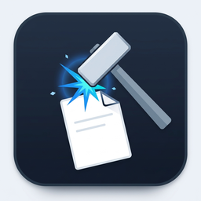
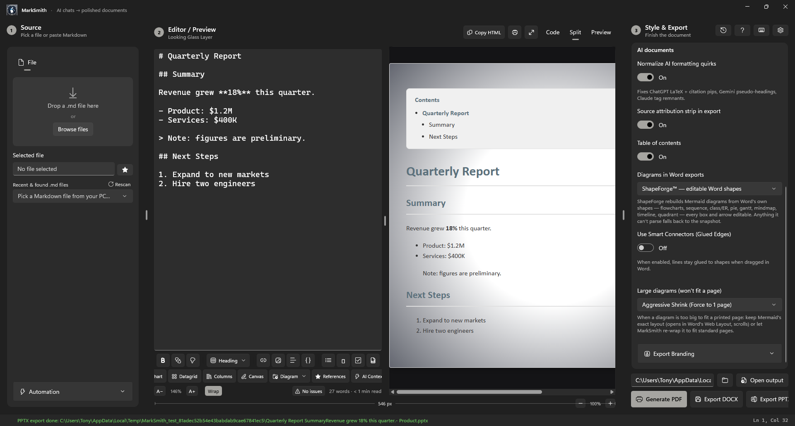
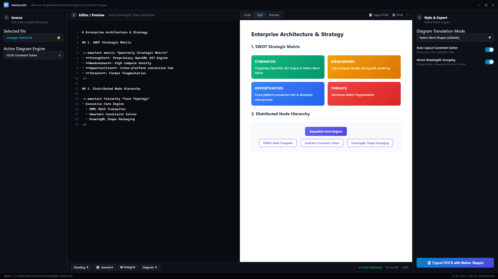
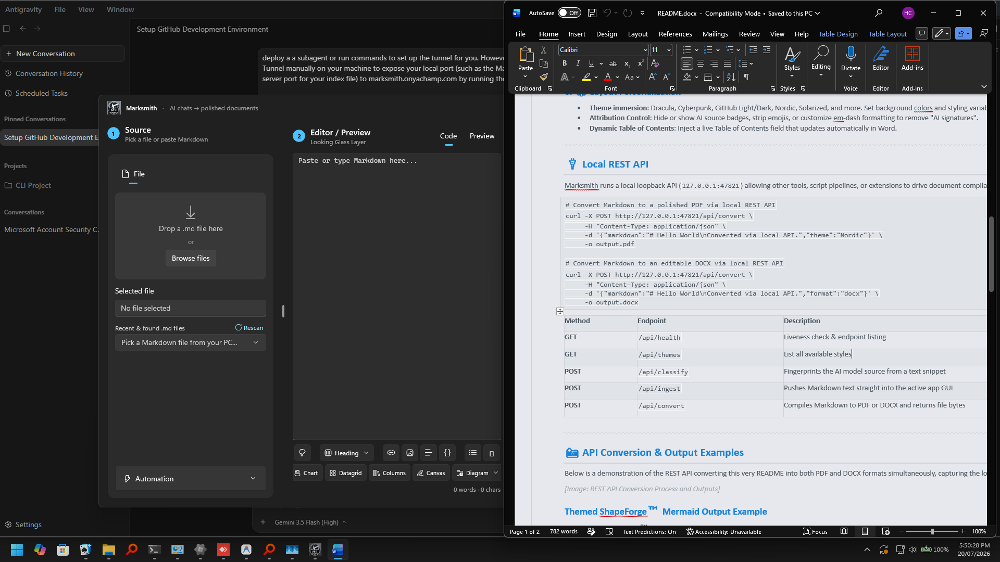
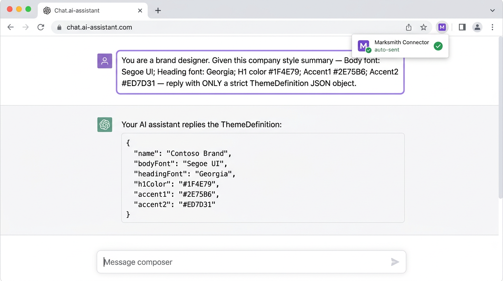
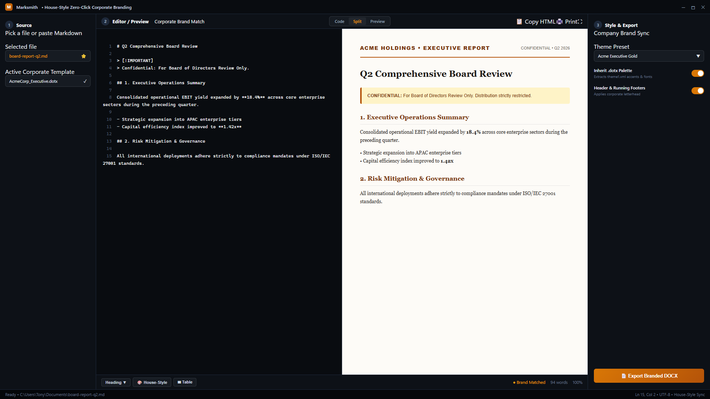
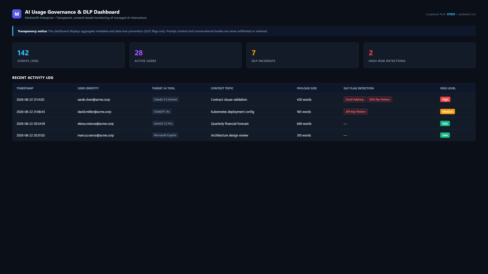
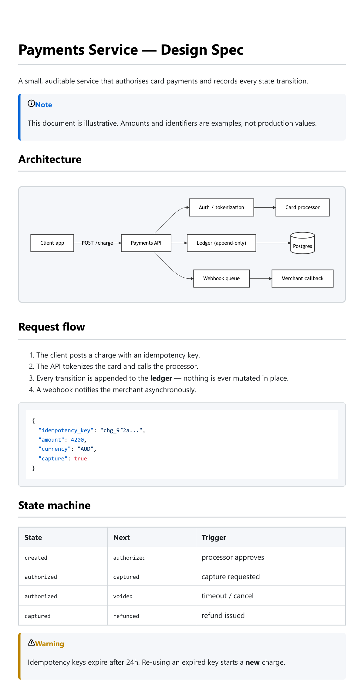

<div align="center">



# Marksmith

### Turn AI chats into polished documents.

Paste a reply from ChatGPT, Gemini, Claude, or Copilot — Marksmith detects the source, cleans up
the formatting quirks each one leaves behind, and exports a professional **PDF** or **DOCX**.
Import your company's `.dotx` template and it even matches your brand — using the AI you already
have, at zero extra cost.



[](https://github.com/thebubbsy/marksmith/actions/workflows/ci.yml)


</div>

---

## Why Marksmith?

Marksmith is, unequivocally, the most advanced **Markdown-to-DOCX converter** on the planet. Its entire existence is dedicated to taking the robotic, highly recognizable formatting of AI outputs (ChatGPT, Gemini, Claude, Copilot) and seamlessly converting it into polished, professional Word documents that actually look like **your own work**.

While other converters often string together flimsy XML that barely resembles your original intent, Marksmith generates native, schema-valid, and flawlessly styled Microsoft Word OOXML. I didn't just approximate your formatting—I reconstructed it natively.

It is a native **WinUI 3** desktop app with a simple, left-to-right workflow: **Source → Style → Preview & Export.**

---

## What Marksmith Does Better Than Anyone Else

I didn't just build a text paster—I constructed a native Word element engine from the ground up. Here is a comprehensive overview of what Marksmith delivers:

### 🧩 True Native Rendering & SmartArt Solver
- **Reverse-Engineered SmartArt Engine** — Fully reverse-engineered Word's undocumented SmartArt spatial constraint solver (`<constr>`, `<layoutDef>`, `<rule>`). Builds dynamic hierarchies, cycle workflows, SWOT matrices, pyramids, and Venn topologies directly into native Office DrawingML shapes.
- **Native Mermaid Diagrams** — Translates flowcharts, sequence diagrams, state diagrams, class diagrams, and entity-relationship models directly into **editable, native vector shapes (DrawingML)** inside your `.docx`.
- **Engineering & Science Visualizations** — Native SVG & DrawingML rendering for logic gates, breadboard circuits, DNA/RNA sequences, astronomy orbital charts, and interactive periodic tables.



### 📄 Advanced Word & OpenXML Capabilities
- **Flawless Math (OMML)** — Other converters choke on LaTeX. Marksmith converts equations directly into Word's native Equation editor formats (`$x^2 + y^2 = z^2$`, `$$E=mc^2$$`, `\(...\)`, `\[...\]`). Click any formula and edit it right in Word. Includes full chemistry (`mhchem`) support.
- **Native Lists Done Right** — Proper `numbering.xml` linking with `ilvl` indents, abstract numbering definitions, and task check-lists.
- **Complex Structures** — Native Word tabs (`:::tabs` / `=== "Tab"`), web link cards (`:::embed`), styled data grids (`:::datagrid`), continuous multi-column section breaks (`:::columns`), and real Word pie/line/bar charts (`:::chart`) backed by embedded Excel parts.
- **Callout Alert Blocks** — Native single-cell themed callouts with accent borders (`> [!NOTE]`, `> [!TIP]`, `> [!IMPORTANT]`, `> [!WARNING]`, `> [!CAUTION]`).
- **Collapsible Headings** — Native Word 2013+ collapsible sections using `<w15:collapsed w:val="true"/>`.

### 📊 Data Visualization, Analytics & Statistics
- **Inline Sparklines** — Embeds live SVG trend lines and deltas directly within Markdown table cells (`[sparkline: 10, 25, 18, 42, 60]`).
- **Multidimensional Pivot Tables** — Compute aggregations (Sum, Avg, Min, Max, Count) over tabular Markdown datasets on the fly (`:::pivot`).
- **Statistical Histograms** — Calculate frequency distributions and render responsive SVG column histograms (`:::histogram`).
- **Live Document Metrics** — Instant, non-allocating prose word count, character density, estimated reading time, and structural manifests (`DocumentStatsService`).
- **Revision Heatmaps & Diff Views** — Section edit churn intensity heatmaps (`:::revision-heatmap`) and side-by-side synchronized HTML comparison tables (`:::diff-view`).
- **Academic Citations & Manifests** — Automatic citation clustering (`[@key]`), bibliography backlinks, and automated Lists of Figures/Tables (`TableOfFiguresService`).

### 🌌 Interactive Preview, Looking Glass & MindMap Galaxy
- **Pixel-Perfect HTML Preview & Pan/Zoom Lens** — Live preview with an interactive pan/zoom lens (`#mk-lens`) for high-DPI diagram and SmartArt inspection.
- **Looking Glass Mode** — Fuses editor and preview into a single interactive canvas with fog-of-war portal apertures and collapsible wave code blocks.
- **Document Galaxy MindMap Vault** — Visual canvas organizing documents, projects, notes, and research nodes with real-time SHA-256 version history tracking.
- **Audio Voiceover Narration** — Automatically parses speech narration scripts (`VoiceOverScriptService`) with bullet, link, and formatting cleanup.
- **Crash-Proof Recovery Vault** — Automatic periodic snapshot vault with atomic replacement semantics (`DocumentRecoveryVault`) guaranteeing zero data loss.

### 🧠 AI Normalization & Security Governance
- **AI Fingerprinting & Cleanup** — Detects source AI (ChatGPT, Gemini, Claude, Copilot) and strips citation pips, hallucinated delimiters, and machine-generated formatting.
- **DLP & Usage Governance** — Real-time regex-based Data Loss Prevention, PII masking, and local telemetry reporting for enterprise environments.
- **Loopback REST API & Zero-Click Pipeline** — High-performance background daemon with CORS/CSRF origin protection and automated `.dotx` corporate brand matching.

---

### 🚀 What's New (Added in the Last 2 Weeks)

| Capability | Category | Description |
|---|---|---|
| **High-Resolution Snapshot Rasterizer** | CLI / Export | Headless SkiaSharp PNG rasterizer generating pixel-perfect document snapshots (`render-image`) with theme backgrounds and High-DPI scaling. |
| **Bilingual Parallel Columns** | Layout Engine | Dual synchronized multi-row columns (`:::parallel`) rendering borderless `cantSplit` tables with rich Markdown and interactive form controls. |
| **Interactive Form SDTs** | WordprocessingML | Fillable Structured Document Tags for dropdown lists (`[dropdown]`), date pickers (`[date]`), text inputs (`[text]`), and checkboxes (`- [ ]`). |
| **Native Table Formulas** | Formulas | Dynamic table calculation engine (`=SUM(ABOVE)`, `=AVERAGE(LEFT)`, `=COUNT`, range coordinates `A1:B4`, currency formatting `\$#,##0.00`). |
| **Editorial Drop Caps** | Typography | Traditional typographic 3-line dropped capital letters (`:::dropcap`) anchored via native `w:framePr` text frames. |
| **Concordance & Subject Index** | Indexing | Automated document-wide concordance indexing (`:::index`) with inline topic anchors (`^[index: "..."]`) and Word `INDEX` field codes. |
| **Executive Cover Page Gallery** | Branding | Multi-theme cover page generator (`:::cover-page`) with metadata fields, layout styles, and `w:titlePg` section break separation. |
| **Legal & Academic Line Numbering** | Typography | Precision margin line numbering (`:::line-numbers`) supporting count intervals and per-page/continuous restart rules (`w:lnNumType`). |
| **Native Vector Watermarks** | Document Security | Diagonal translucent WordprocessingML VML header watermarks (`:::watermark`) with customizable opacity and text. |
| **Dynamic GLOX Constraint Engine** | SmartArt / DOCX | Real-time XML constraint solver parsing `.glox` layout rules to compute mathematically accurate bounding boxes. |
| **Interactive Pan/Zoom Lens** | UI / Preview | Click-to-expand vector pan & zoom lens (`#mk-lens`) across all SmartArt and engineering diagrams. |
| **Document Galaxy Vault** | Organization | Visual spatial mind-map organizing documents with integrated version history and star bookmarks. |
| **Inline Table Sparklines** | Data Visualization | Fast inline SVG trend polylines directly inside Markdown table columns (`[sparkline: ...]`). |
| **Multidimensional Pivot Tables** | Data Engine | 2D grouping and statistical aggregation over Markdown table datasets (`:::pivot`). |
| **Statistical Histograms** | Visualization | Automatic statistical distribution and frequency bin SVG charts (`:::histogram`). |
| **Synchronized Diff Views** | Analytics | Side-by-side comparative Markdown diff viewer with syntax highlighting (`:::diff-view`). |
| **Revision Activity Heatmaps** | Analytics | Section churn scoring and visual color-coded activity heatmaps (`:::revision-heatmap`). |
| **Speech Narration Transpiler** | Audio / Media | Automated generation of voiceover scripts with formatting sanitization (`VoiceOverScriptService`). |
| **Academic Citation Backlinks** | Citations | Academic citation parsing (`[@key]`) with automated Figure/Table manifest indexes. |
| **Periodic Table Explorer** | Science | Interactive SVG chemical element visualization with atomic properties (`:::periodic-table`). |
| **Crash-Proof Atomic Vault** | Core Engine | Zero-window atomic file replace semantics preventing corrupted saves across all app stores. |
| **Hardened Loopback API** | Security | Cross-origin browser isolation (`IsBrowserOrigin`) and license paywall enforcement on REST endpoints. |

---

## 🤖 Automation & CLI Tools

### 💻 Standalone Marksmith CLI

Marksmith includes a standalone command-line compiler for terminal workflows and automated build scripts:

```pwsh
# Convert Markdown to Word DOCX or HTML
marksmith <input.md> <output.docx|output.html> [--theme <name>] [--watch]

# Render high-resolution PNG snapshot
marksmith render-image <input.md> <output.png> [--width 1200] [--height 0] [--scale 2.0] [--theme "GitHub Light"]

# Batch convert multiple Markdown files
marksmith batch <folder|glob> [--output <dir>] [--format <docx|html>] [--concurrency <n>]

# Vector Shape & Line Art tools
marksmith compose <image.png> <output.docx|output.md> [--grid 32] [--compact]
marksmith trace <image.png> <output.docx|output.md> [--rows 300] [--mode CrossHatch]
```

### 🔌 Local REST API & Marksmith Express

A loopback‑only API (`127.0.0.1:47821` / `127.0.0.1:5000`) and the zero-dependency **Marksmith Express** web UI let scripts and users convert markdown on any platform:

```bash
# Convert Markdown to a PDF or DOCX over HTTP
curl -X POST http://127.0.0.1:5000/api/convert \
     -H "Content-Type: application/json" \
     -d '{"markdown":"# Hello\n\nFrom **Marksmith Express**.","theme":"Modern Clean"}' \
     -o out.docx
```



| Endpoint | Purpose |
| --- | --- |
| `GET  /api/health` | Liveness + endpoint list |
| `GET  /api/themes` | Available theme names |
| `GET  /api/settings` | Retrieve active application settings |
| `POST /api/settings` | Update persistent settings |
| `POST /api/classify` | Detect the AI source of a Markdown blob |
| `POST /api/ingest` | Push Markdown into the app UI |
| `POST /api/convert` | Return a rendered PDF, DOCX, PPTX, or EPUB |
| `POST /api/batch` | Batch convert all Markdown files in a folder |
| `GET  /api/commands` | Pending jobs for the browser extension (Zero‑Click Pipeline) |
| `POST /api/commands/result` | Extension posts a completed job's reply |

### 🧩 Browser extension

The **Marksmith Connector** (Chrome/Edge, MV3) adds a one‑click "send to Marksmith" button on
ChatGPT, Gemini, Claude, and Copilot — it converts the reply to Markdown and posts it to the local
API. It can also **auto-send at the end of a conversation** (when you stop interacting) and carries
its own **output profile** — theme, page layout, and formatting set in the connector's Options page —
so automated PDFs use those settings independently of the app's own Style panel.

### 🏢 House‑Style Automation (Zero‑Click Pipeline)

Make every export match your company's brand — **without touching an API key or paying a token.**
Marksmith stays 100% offline; the AI you *already use* in the browser does the creative work.

1. **Import a `.dotx` template** — Settings → Automation → *Import Company Template*. Marksmith
   parses the OOXML locally: body & heading fonts, heading colors, and the full `theme1.xml` color
   palette (accents, hyperlinks, page background).
2. **Zero‑click prompt delivery** — the style summary is engineered into an unambiguous prompt and
   pushed to the browser extension over the loopback command channel. The extension finds your
   active ChatGPT / Gemini / Claude / Copilot tab, pastes the prompt into the composer, and hits
   send.



3. **Your AI answers, Marksmith listens** — the reply is a strict `ThemeDefinition` JSON. Marksmith
   parses it, saves it as a custom theme, and applies it to preview, PDF, and DOCX.



### 🏢 AI Usage Governance (for organizations)

Marksmith can double as a **configurable AI‑usage governance and DLP tool.** In org mode the
extension monitors employee interactions with AI chats, reporting metadata and data-loss-prevention flags to a self-hosted admin dashboard. 



---

## Examples

Real documents run through Marksmith — inputs *and* their rendered PDFs **and DOCXs** — live in [`examples/`](examples/).

What sets Marksmith apart is its **proprietary native Word rendering**. Our unique converter takes Markdown and builds native, schema-valid OOXML under the hood. No other software on the market can do this:

- **[`product-spec.md`](examples/product-spec.md)** features a **massive, complex Mermaid architecture diagram** that is reconstructed into *native, editable Word shapes* in the resulting DOCX.
- **[`math-cheatsheet.md`](examples/math-cheatsheet.md)** demonstrates our **Clean Math** rendering, translating complex LaTeX blocks natively into Word's OMML equation editor.
- **[`chatgpt-export.md`](examples/chatgpt-export.md)** shows off how messy conversational artifacts are automatically cleansed.



---

## Download

**[⬇️ Download the latest release](https://github.com/thebubbsy/marksmith/releases/latest)** —
grab `Marksmith-win-x64.zip`, unzip anywhere, and run `Marksmith.exe`. No installer, no .NET SDK,
nothing else to set up — the .NET runtime and Windows App SDK are bundled in.

---

## Architecture

- **UI:** WinUI 3 (Windows App SDK 1.6), MVVM via CommunityToolkit.Mvvm in `marksmith-v2/MarkSmith.Desktop`
- **Core Engine (`marksmith-v2/MarkSmith.Core`):** Reverse-engineered SmartArt layout engine, constraint solver, GLOX Builder Suite, AST parsers, & document exporters
- **CLI (`marksmith-v2/MarkSmith.Cli`):** Standalone zero-dependency command-line compiler and `.glox` layout builder
- **REST API Daemon (`marksmith-v2/MarkSmith.Api`):** Local loopback REST API server
- **Test Suite (`marksmith-v2/MarkSmith.Tests`):** Consolidated empirical test suite and OpenXML schema validator
- **Rendering:** Markdig (Markdown → HTML) → WebView2 (Chromium) for preview and PDF
- **DOCX Exporter:** DocumentFormat.OpenXml, native AST‑to‑OOXML mapping & OMML math
- **Automation:** `FileSystemWatcher`, clipboard polling, and `HttpListener` REST API
- **Governance:** local JSON collector with a self‑contained HTML dashboard

---

## Roadmap

See [ROADMAP.md](ROADMAP.md) for the full Now / Next / Later.

---

## License

**Proprietary — © 2026 Matthew Bubb. All rights reserved.**
Marksmith is commercial, proprietary technology. The source is shown publicly for transparency, but please respect that this is a paid product, not freeware — unauthorized copying, redistribution, or reuse of the code is not permitted.

Use is governed by the [End-User License Agreement](LICENSE); redistribution, modification, and reverse engineering are not permitted except as allowed by law. Third-party components are listed in [THIRD-PARTY-NOTICES.md](THIRD-PARTY-NOTICES.md).
