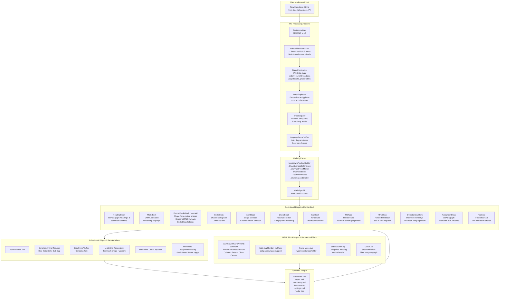
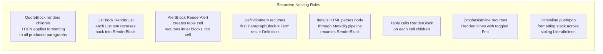

# Marksmith Rendering Engine — Architecture Diagram

## Pipeline Overview



## Nesting and Recursion Rules



## Format State Machine for Inline HTML

```mermaid
stateDiagram-v2
    [*] --> Default: Start rendering inlines
    Default --> Bold: b or strong tag
    Default --> Italic: i or em tag
    Default --> Underline: u or ins tag
    Default --> Strike: del or s tag
    Default --> Code: kbd or code tag
    Default --> Highlight: mark tag
    Default --> Sub: sub tag
    Default --> Sup: sup tag
    Default --> Colored: span with style color
    Bold --> Default: closing tag stack pop
    Italic --> Default: closing tag stack pop
    Underline --> Default: closing tag stack pop
    Strike --> Default: closing tag stack pop
    Code --> Default: closing tag stack pop
    Highlight --> Default: closing tag stack pop
    Sub --> Default: closing tag stack pop
    Sup --> Default: closing tag stack pop
    Colored --> Default: closing tag stack pop
```
