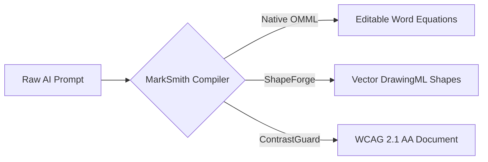

# Enterprise Distributed Architecture

The MarkSmith compiler transforms Markdown ASTs into native Office OpenXML packages with zero COM dependency:

Unlike legacy tools that embed blurry raster images, MarkSmith translates Mermaid code fences into **native grouped vector shapes**:

> [!TIP]
> In Microsoft Word, you can click on each diagram box, change its fill color, drag connector lines, and edit label text. Real Office DrawingML vectors.
