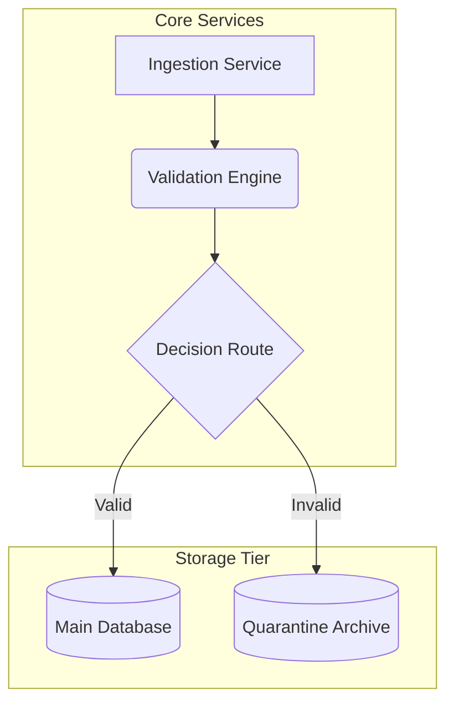
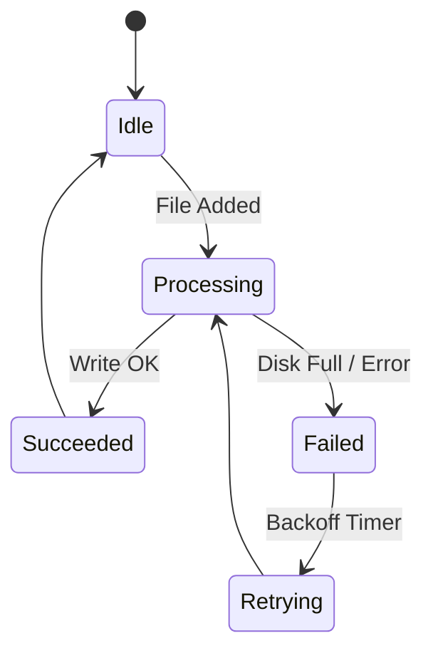

# The MarkSmith OpenXML Gauntlet

This document is a stress-test for Markdown-to-OpenXML (DOCX) and PDF rendering pipelines. It compiles the most complex, nested, and historically "impossible" formatting tasks to verify visual parity, layout stability, and structural compliance.

---

## 1. Advanced Mathematical Equations (LaTeX to OMML)

Microsoft Word historically struggled with importing LaTeX math directly. Marksmith parses LaTeX math blocks and translates them into native Office Math Markup Language (OMML) objects.

### 1.1. Multiline Block Math with Matrices and Alignment
A complex Schrödinger equation with a Hamiltonian matrix operator:

$$
i\hbar\frac{\partial}{\partial t}\Psi(\mathbf{r},t) = \hat{H}\Psi(\mathbf{r},t)
$$

Where the Hamiltonian matrix $\hat{H}$ is defined in a discrete 3D basis:

$$
\hat{H} = \begin{pmatrix}
E_0 + V_1 & -t_{12} & 0 \\
-t_{12} & E_0 + V_2 & -t_{23} \\
0 & -t_{23} & E_0 + V_3
\end{pmatrix} + \sum_{n=1}^{N} \frac{\hbar^2 k_n^2}{2m} \mathbf{I}
$$

### 1.2. Integrals, Limits, and Chemistry Extensions
A thermodynamic partition function combined with chemical stoichiometry equations:

$$
Z(\beta) = \lim_{N \to \infty} \int_{-\infty}^{\infty} \cdots \int_{-\infty}^{\infty} \exp\left( -\beta \sum_{i<j} V(r_{ij}) \right) d\mathbf{r}_1 \cdots d\mathbf{r}_N
$$

Chemical equilibrium equation using the `mhchem` extension:

$$
\ce{N2 + 3H2 <=> 2NH3} \quad (\Delta H^\circ = -92.4\text{ kJ/mol})
$$

$$
\ce{2H2O ->[electrolysis] 2H2 + O2}
$$

---

## 2. Code Fences with Captions and Highlighting

Word has no built-in code block or syntax highlighter. Marksmith translates code blocks into structured runs, maintaining precise syntax coloring and code captions.

```rust:main.rs
// Rust server entrypoint showing error handling and concurrency
use std::sync::Arc;
use tokio::net::TcpListener;

#[tokio::main]
async fn main() -> Result<(), Box<dyn std::error::Error>> {
    let listener = TcpListener::bind("127.0.0.1:8080").await?;
    let state = Arc::new(Database::connect().await?);
    println!("Server listening on http://127.0.0.1:8080");

    loop {
        let (socket, _) = listener.accept().await?;
        let db = Arc::clone(&state);
        tokio::spawn(async move {
            if let Err(e) = handle_connection(socket, db).await {
                eprintln!("Error handling connection: {}", e);
            }
        });
    }
}
```

---

## 3. High-Complexity Nested Tables (The "Layout Exploder")

Tables in Word often collapse or distort when cells contain complex layouts. Pipe-table cells are inline-only in GFM, so Marksmith recovers block content written into a cell — a `<br>`-joined list, a GitHub alert — and renders it as a real block in both the preview and the native Word table.

| Feature / Element | Raw Syntax Test | Rendered Result |
| :--- | :--- | :--- |
| **Mathematics** | `$E = mc^2$` | Inline math renders in the cell: $\sum_{i=1}^{k} x_i$ |
| **Monospace / Code** | `` `let x = 1;` `` | Inline code keeps its face inside the grid: `let x = 1;` |
| **Nested Lists** | `- Subitem 1<br>- Subitem 2` | - Subitem 1<br>- Subitem 2 |
| **Alert Blocks** | `> [!WARNING] Mind the gap!` | > [!WARNING] Mind the gap! |
| **Alert, multi-line** | `> [!TIP]<br>> Cells carry blocks.` | > [!TIP]<br>> Cells carry blocks, not just inline text. |

---

## 4. Multi-Tab Options Layout

A native markdown dialect extension allowing tab switches. For static targets like PDF and DOCX, Marksmith converts this structure into segmented, labeled section containers.

=== "Option A: REST API"
    To query the service endpoint, send a POST request with the authentication header:
    ```bash
    curl -X POST https://api.marksmith.local/v1/export \
      -H "Authorization: Bearer ms_live_key" \
      -H "Content-Type: application/json" \
      -d '{"format": "pdf"}'
    ```

=== "Option B: CLI Ingest"
    Alternatively, trigger the locally running instance using the command line:
    ```powershell
    marksmith.exe --input document.md --format docx --output dist/
    ```

=== "Option C: Folder Watcher"
    Drop any markdown file into the folder specified in settings:
    `C:\Users\Tony\Documents\Marksmith\Watch`

---

## 5. Dialect Elements: WikiLinks, Tags, and Collapsible Callouts

### 5.1. Custom Dialect Links & Badges
* Check the latest design guidelines in the [[Project Architecture]] draft.
* Redirect to custom landing page: [[product-spec|Detailed Product Specification]].
* High-priority release item tagged with `#milestone-1.0` and `#security-audit`.

### 5.2. Foldable Obsidian-Style Callouts
> [!CAUTION]- Critical Security Reminder
> This block should collapse by default in interactive preview, but display fully expanded in DOCX/PDF output.
> - Never store database credentials in the project root.
> - Bind the server strictly to loopback IP `#127.0.0.1`.

---

## 6. Deeply Nested List Indentation

List items with mixed numbering, bullets, blockquotes, and code blocks:

1. Level 1: Primary Configuration
    * Level 2: Databases
        1. Level 3: Postgresql Master
            > Every ledger write must be committed to disk before transaction acknowledgment.
            ```sql
            INSERT INTO ledger (state, recorded_at) VALUES ('AUTHORIZED', NOW());
            ```
        2. Level 3: Redis Read Replica (cache-aside)
    * Level 2: Queue
2. Level 1: Deployment Target

---

## 7. Complex Mermaid Diagrams

### 7.1. Flowchart with Subgraphs


### 7.2. State Diagram


---

## 8. Multi-Line Footnotes

Footnotes are referenced in-line like this[^1] and also here[^2].

[^1]: This is a standard single-line footnote.
[^2]: This is a **multi-line** footnote.
    * It includes bullet points inside the footnote.
    * It can also contain code: `var x = 42;`.
    * Word must link this footnote back to its exact reference site.
