# Mermaid — Every Diagram Type

A gauntlet of every diagram family Mermaid v11 ships, for comparing the **live preview**, the
**DOCX ShapeForge export**, and the reference descriptions.

Each fence is tagged with the export path Marksmith takes:

- **Native** — a bespoke geometry renderer rebuilds it as editable Word shapes (no browser).
- **Harvest** — mermaid renders it in the browser; Marksmith harvests the SVG primitives and
  rebuilds them as native Word shapes.
- **Snapshot** — falls back to an embedded picture, then a code block.

---

## 1. Flowchart (top-down) — Native

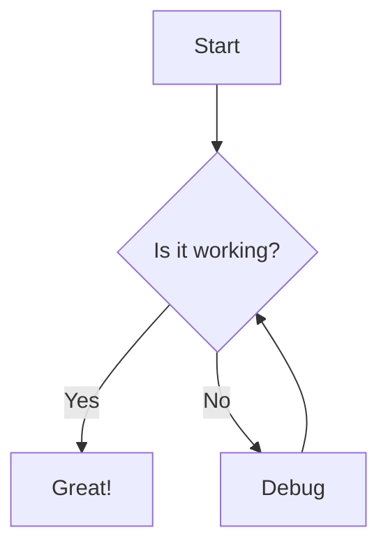

## 2. Flowchart (left-right) — Native

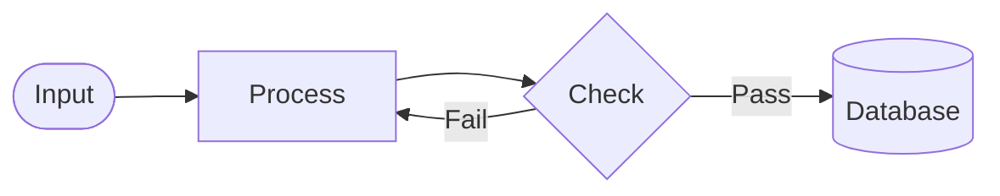

## 3. Sequence Diagram — Native

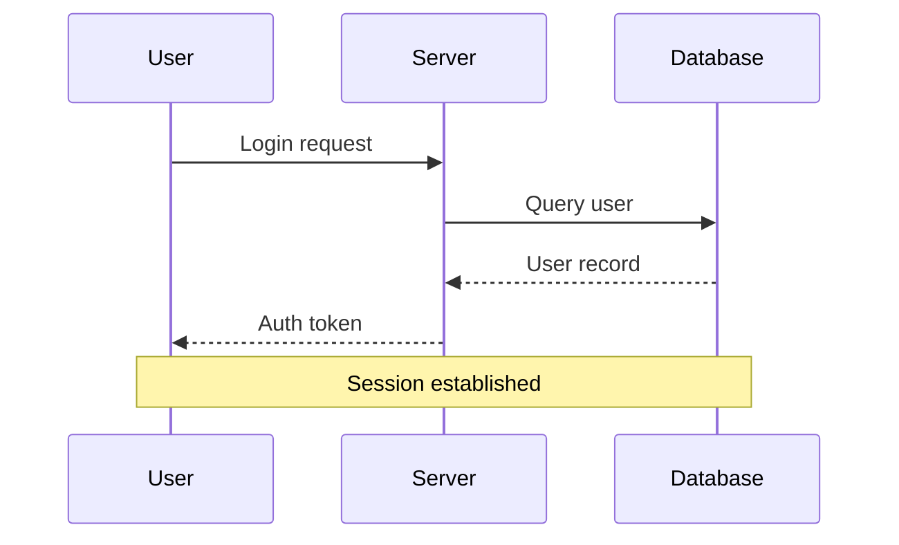

## 4. Class Diagram — Native

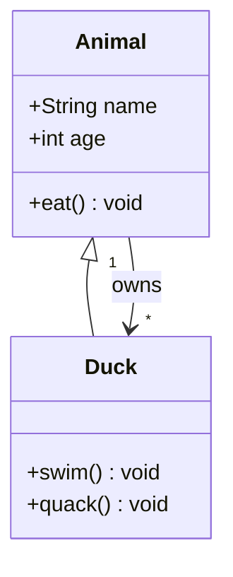

## 5. State Diagram — Harvest

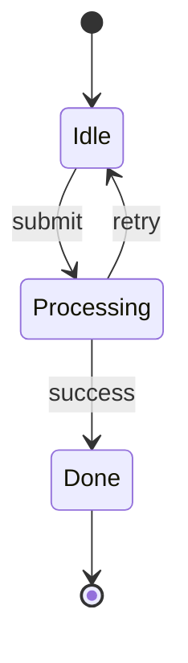

## 6. ER Diagram — Native

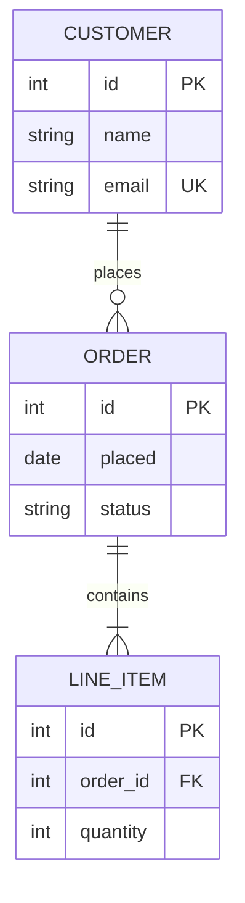

## 7. User Journey — Native

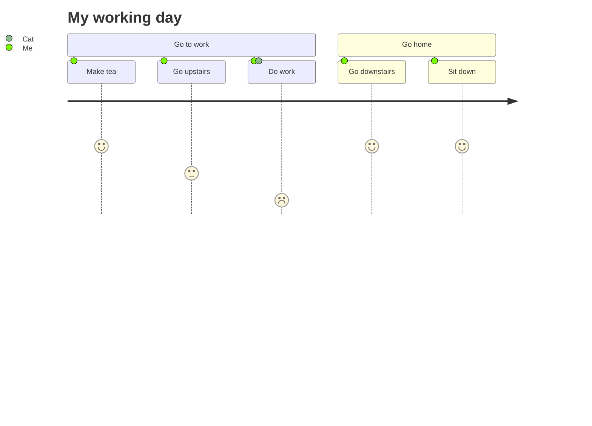

## 8. Gantt Chart — Native

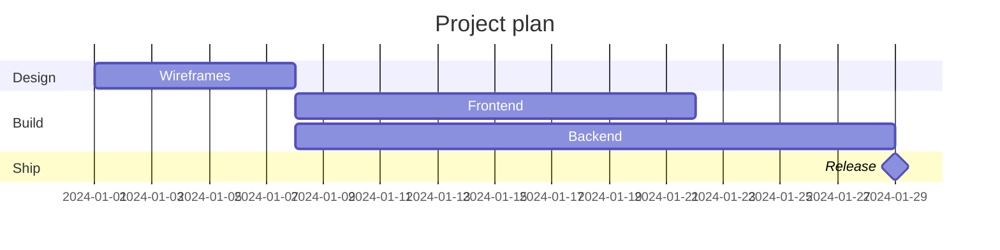

## 9. Pie Chart — Native

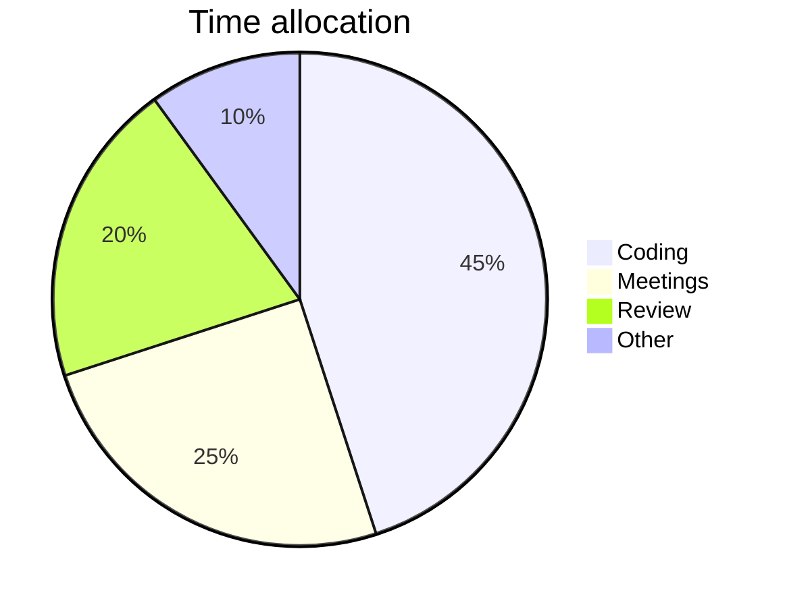

## 10. Quadrant Chart — Native

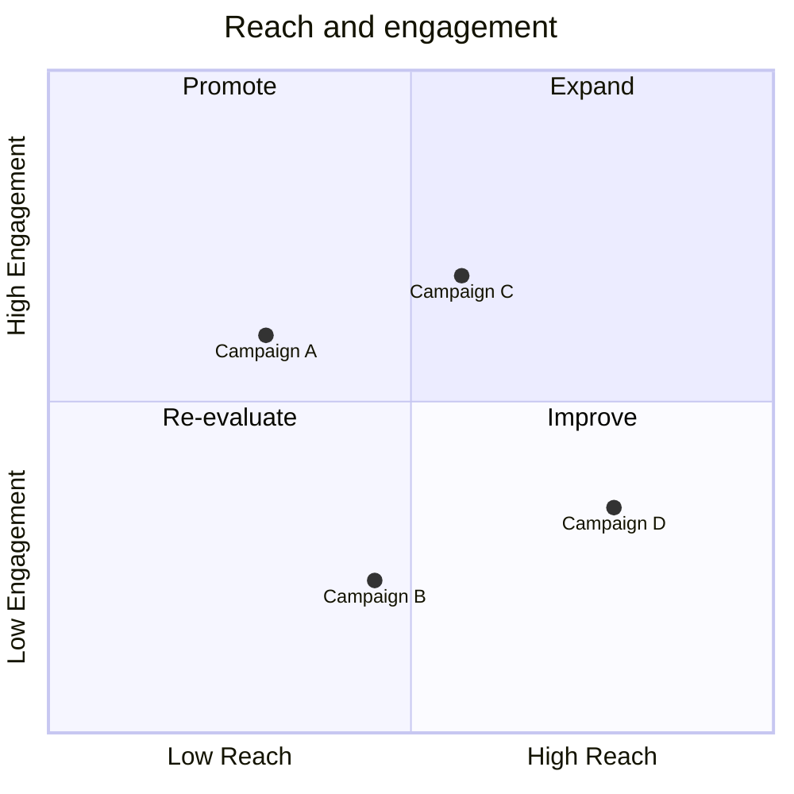

## 11. Requirement Diagram — Harvest

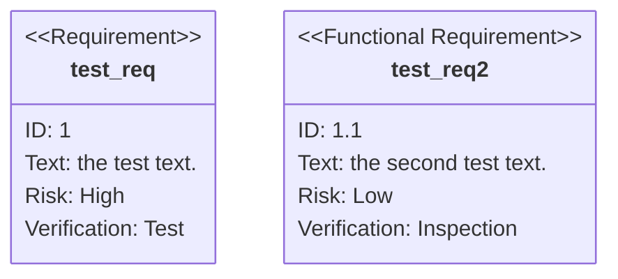

## 12. Git Graph — Native

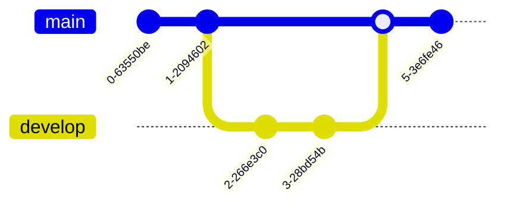

## 13. C4 Context — Harvest

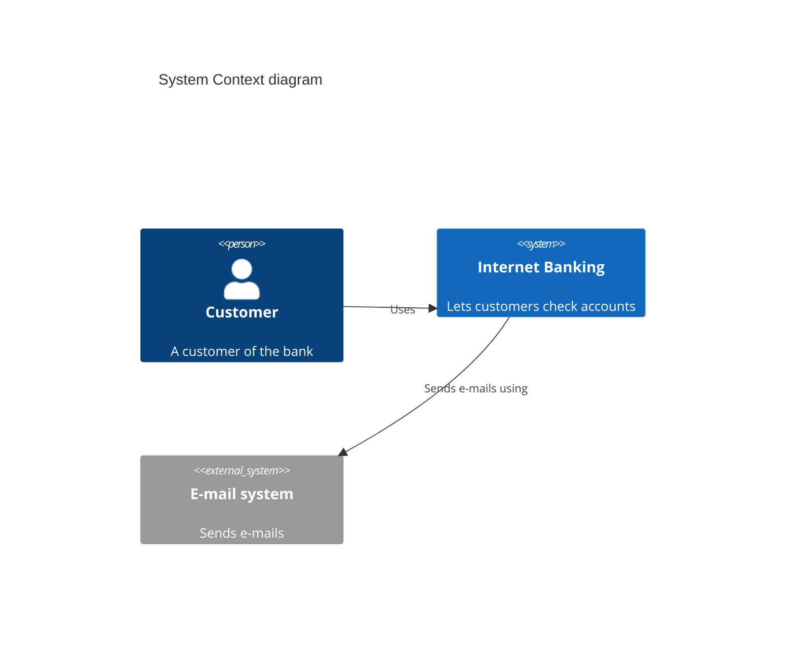

## 14. Mindmap — Native

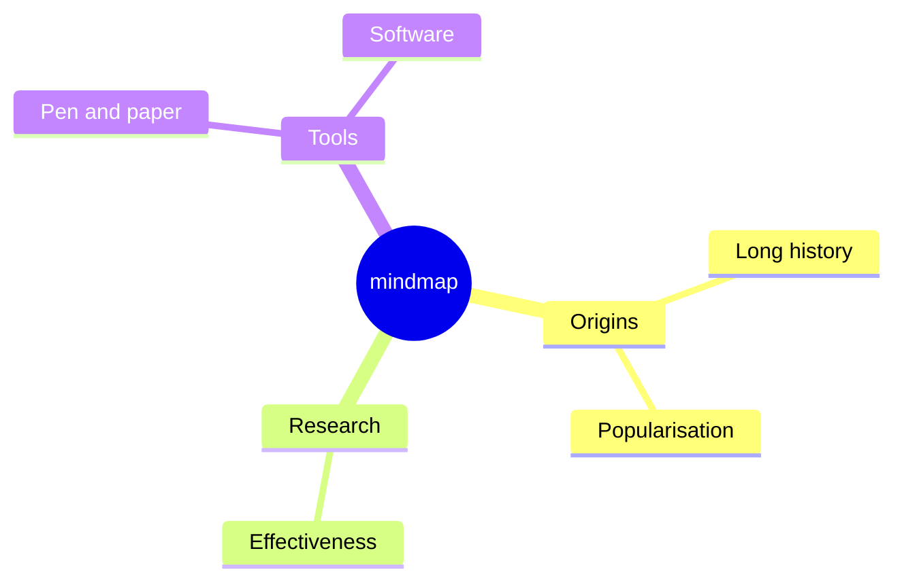

## 15. Timeline — Native

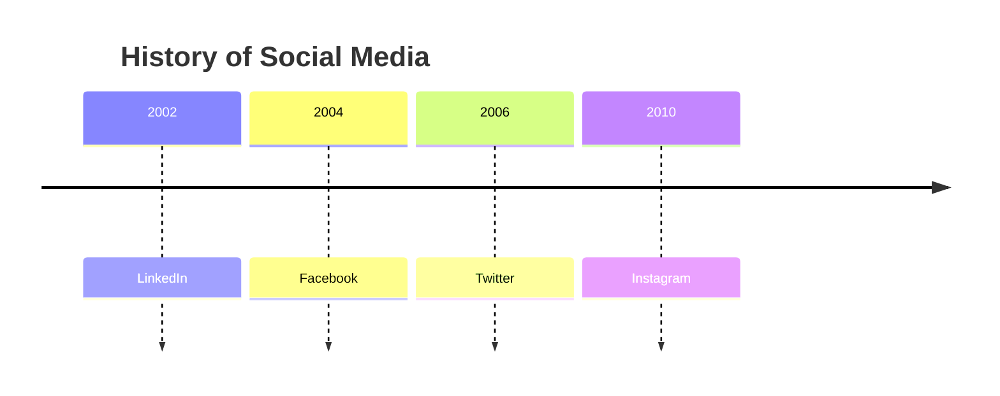

## 16. ZenUML — Harvest

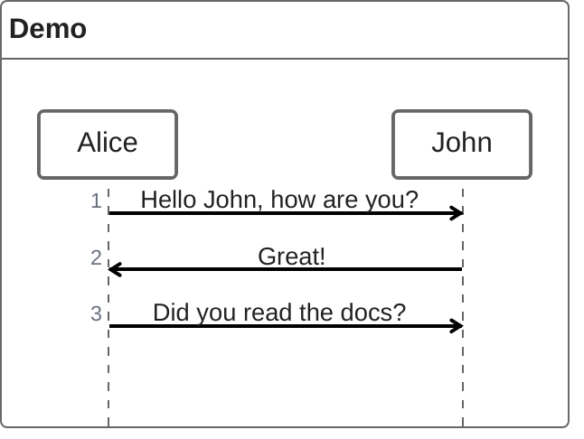

## 17. Sankey — Harvest

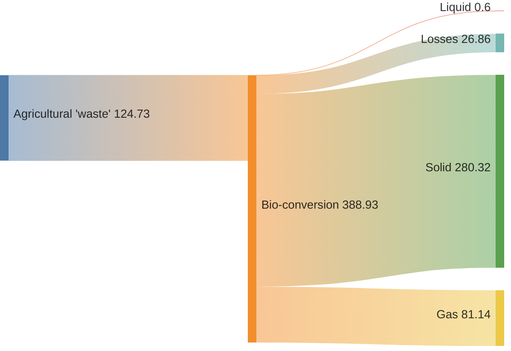

## 18. XY Chart — Native

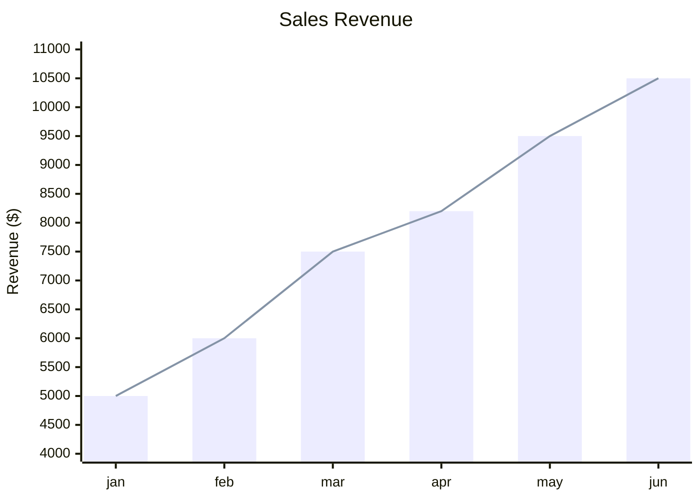

## 19. Block Diagram — Harvest

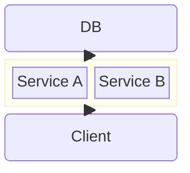

## 20. Packet — Harvest

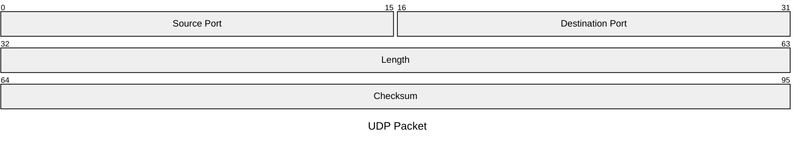

## 21. Kanban — Harvest

```mermaid
kanban
  id1[Todo]
    docs[Create Documentation]
    blog[Write blog post]
  id2[In Progress]
    feature[Build feature]
  id3[Done]
    tests[Write tests]
```

## 22. Architecture — Harvest

```mermaid
architecture-beta
    group api(cloud)[API]

    service db(database)[Database] in api
    service disk1(disk)[Storage] in api
    service server(server)[Server] in api

    db:L -- R:server
    disk1:T -- B:server
```
