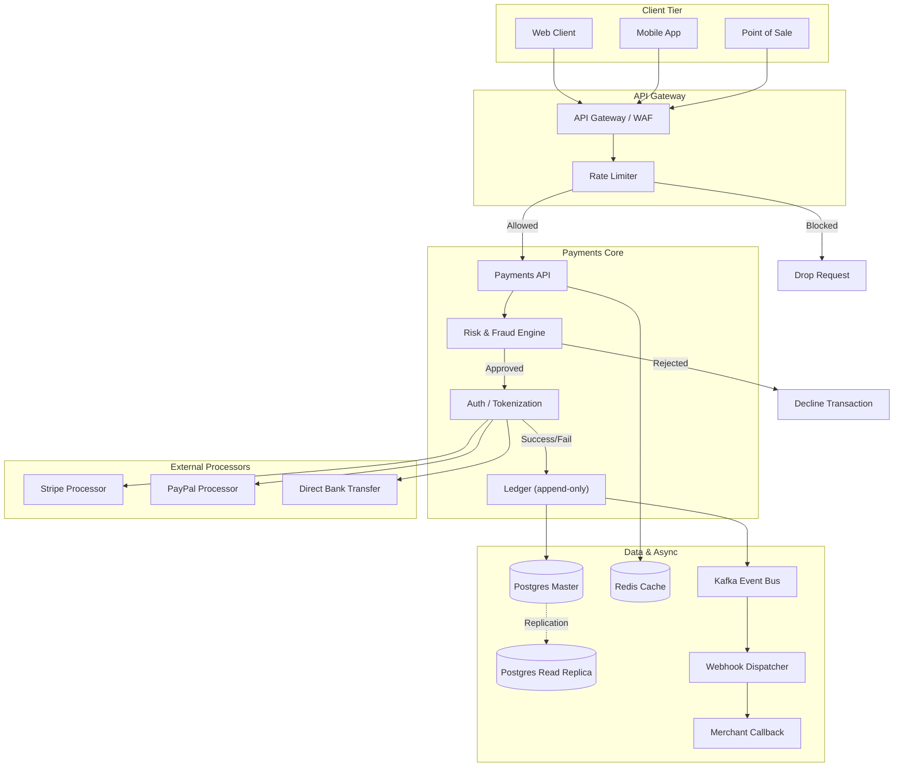

# Payments Service — Design Spec

A small, auditable service that authorises card payments and records every state transition.

> [!NOTE]
> This document is illustrative. Amounts and identifiers are examples, not production values.

## Architecture



## Request flow

1. The client posts a charge with an idempotency key.
2. The API tokenizes the card and calls the processor.
3. Every transition is appended to the **ledger** — nothing is ever mutated in place.
4. A webhook notifies the merchant asynchronously.

```json
{
  "idempotency_key": "chg_9f2a...",
  "amount": 4200,
  "currency": "AUD",
  "capture": true
}
```

## State machine

| State | Next | Trigger |
| --- | --- | --- |
| `created` | `authorized` | processor approves |
| `authorized` | `captured` | capture requested |
| `authorized` | `voided` | timeout / cancel |
| `captured` | `refunded` | refund issued |

> [!WARNING]
> Idempotency keys expire after 24h. Re-using an expired key starts a **new** charge.
