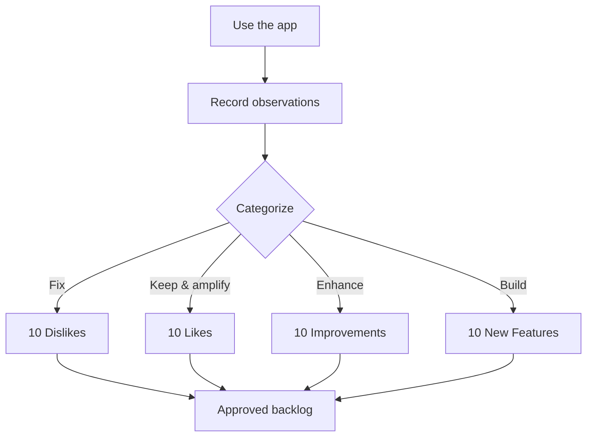

# MarkSmith Enhancement Proposal

A hands-on review of the MarkSmith WinUI 3 app, conducted by actually driving the shipped build
(pasting real Markdown, exporting, and exercising the Diagram Studio), followed by a concrete plan
of what to fix, polish, and build next.

> **Status:** Approved. The items below are the working backlog.

## How this review was done

The application was launched and used end-to-end: sample Markdown was pasted, the live preview was
inspected across themes, the Diagram Studio was opened and edited (auto layout, fit, quick-add,
inline rename, delete), exports were produced, and the Welcome Tour and Settings were walked. Every
observation below is backed by a screenshot and a reproducible trigger.

---

## 1. Ten things I didn't like

| # | Issue | Why it hurts |
|---|-------|--------------|
| 1 | **Exports give zero feedback.** Clicking *Generate PDF* or *Export DOCX* shows no progress, toast, or status. | Users can't tell if anything happened; success is only discoverable by finding the file on disk. |
| 2 | **Export filenames are atrocious.** Derived from raw document *content*, e.g. `Proposal TestThis is a bold claim...## Features- Bullet one- Bu..pdf`. | Markdown syntax (`##`, `-`) is smashed into the name and truncated with a literal `..`. Unprofessional and hard to find. |
| 3 | **No PPTX export button** despite PPTX being a stated purpose. Only PDF and DOCX buttons exist. | The export engine is fully implemented but unreachable from the UI. The tour even advertises PPTX. |
| 4 | **Default output location is a GUID-named Temp folder** (`MarkSmith_test_<guid>`), shown truncated in the UI. | Users can't predict where their document lands. |
| 5 | **"Visual Studio 🎨" mislabels the Diagram Studio entry point.** | "Visual Studio" is a Microsoft product; the window it opens is titled "Mermaid Diagram Studio". Confusing branding. |
| 6 | **Diagram Studio parser mangles edge labels into node labels.** `B -->\|Yes\| C[Do it]` renders as a node `\|Yes\| C[Do it]`. | The main preview renders it correctly, so the Studio's own parser is the odd one out. Real bug. |
| 7 | **A debug "Test Theme 6b9d18c0…" leaked into the theme dropdown.** | A debug artifact sits next to GitHub Light, Dracula, etc. Looks unfinished. |
| 8 | **Tour pagination dots never advance** — every step shows 4 dots with the first filled, across 6+ screens. | Misleading progress indicator. |
| 9 | **Tour's final step pre-checks "Load a sample document"**, which silently replaces pasted content on "Get started". | A destructive default that can destroy the user's work. |
| 10 | **Diagram Studio closes without an unsaved-changes prompt.** | Edits not yet synced to Markdown can be silently lost. |

---

## 2. Ten things I did like

| # | Delight | Detail |
|---|---------|--------|
| 1 | **Numbered 3-column workflow** (1 Source → 2 Editor/Preview → 3 Style & Export). | The pipeline is instantly understandable at a glance. |
| 2 | **Live preview is genuinely live and fast.** | Headings, bold/italic, inline code, lists, blockquotes, tables, and Mermaid all render correctly and re-render instantly on theme change. |
| 3 | **Native Mermaid rendering is beautiful.** | Navy rounded nodes, yellow edge labels, green arrowheads — far better than an embedded web screenshot. |
| 4 | **Floating "Contents" mini-TOC** in the preview. | A delightful, unobtrusive navigation aid. |
| 5 | **Page-width realism.** | A real page scaled to fit, with a live `px` readout and "Lock to A4 width" to keep it honest. |
| 6 | **Microcopy under every toggle** explains consequences. | e.g. under "Single continuous page": what it means when the DOCX opens in Web Layout. |
| 7 | **Diagram Studio is a real editor, not a gimmick.** | Quick-add directional handles, live Properties Inspector, status-bar feedback, grid-snap readout, and a searchable 8-category shape palette. |
| 8 | **Inline rename of nodes** on the canvas, committing on focus loss. | Fast, in-place editing without a modal dialog. |
| 9 | **Settings are polished.** | License trial state is clear, plugins show size estimates, About has full build info. |
| 10 | **The Welcome Tour is well written.** | Concrete, feature-rich copy (ShapeForge™, OMML math, REST API) with Skip/Back/Next and a replay hint. |

---

## 3. Ten feature improvements

Enhancements to things that already exist.

1. **Export feedback loop.** Show a progress indicator on the button, a success toast with the file name, and a status-bar message. Make the disabled *Cancel* button meaningful during a long export.
2. **Sane export filenames.** Derive the name from the document's H1 or the source file name, sanitized of Markdown/path characters, with a collision-safe suffix.
3. **Wire up the PPTX export button.** The `PptxExportService` exists — add a third export button (and an EPUB affordance) to match the advertised capability.
4. **Sensible default output folder.** Default to the source file's folder (or Documents), remember the last-used location, and show the full path.
5. **Fix the Diagram Studio edge-label parser** so `A -->|label| B[Node]` produces a node `Node` with an edge labeled `label`, matching the main renderer.
6. **Remove the leaked "Test Theme"** (and any non-shipping themes) from the user-facing dropdown.
7. **Fix the tour pagination dots** to reflect the real step count and current position.
8. **Make the tour's sample-load opt-in.** Uncheck "Load a sample document" by default, and never replace existing content without confirmation.
9. **Add an unsaved-changes prompt to Diagram Studio** when closing with edits not synced to Markdown.
10. **Rename "Visual Studio 🎨" to "Diagram Studio"** (or "Edit visually") to stop borrowing Microsoft's product name.

---

## 4. Ten new features

Net-new capabilities to build.

1. **Batch export.** One click to produce PDF + DOCX + PPTX together, with a combined progress summary.
2. **Export history.** A recent-exports list (format, path, timestamp) with one-click re-export and "open containing folder".
3. **Custom filename templates.** A user-editable pattern such as `{title} - {date}.{ext}`.
4. **Undo/redo in Diagram Studio.** A command stack for add/move/delete/rename so experiments are safe.
5. **Diagram minimap.** A small overview of the whole canvas for navigating large diagrams.
6. **Editor ↔ preview sync-scroll.** Scrolling the Markdown source scrolls the preview to the matching region, and vice versa.
7. **Keyboard shortcuts cheatsheet.** A discoverable dialog (invoked from the `?` button) listing all shortcuts instead of hidden tooltips.
8. **Theme preview swatches & favorites.** Show a tiny color preview per theme in the dropdown and let users pin favorites to the top.
9. **Drag-and-drop image embedding.** Dropping an image into the editor inserts a Markdown image reference and copies the asset alongside the export.
10. **Command palette (Ctrl+K).** Fuzzy search across actions, themes, and recent files for power users.

---

## Summary

The foundations are strong — the live preview, native diagram rendering, and the Diagram Studio are
genuinely impressive. The highest-leverage work is closing the **export experience gap** (feedback,
filenames, output location, and the missing PPTX button) and fixing a handful of **visible polish
bugs** (leaked test theme, tour dots, edge-label parsing). The new-feature list then extends the
app's strengths in editing and export ergonomics.
