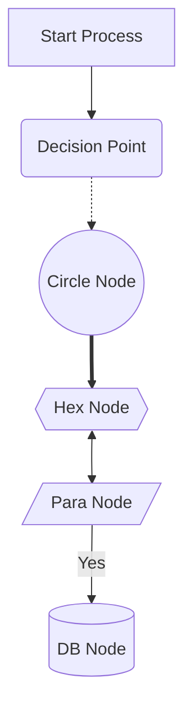

# Diagram Round Trip

```mermaid
flowchart TD
    A["Start Process"]
    B("Decision Point")
    C(("Circle Node"))
    D{{"Hex Node"}}
    E[/"Para Node"/]
    F[("DB Node")]
    A --> B
    B -.-> C
    C ==> D
    D <--> E
    E -- "Yes" --> F
```

After the diagram.
